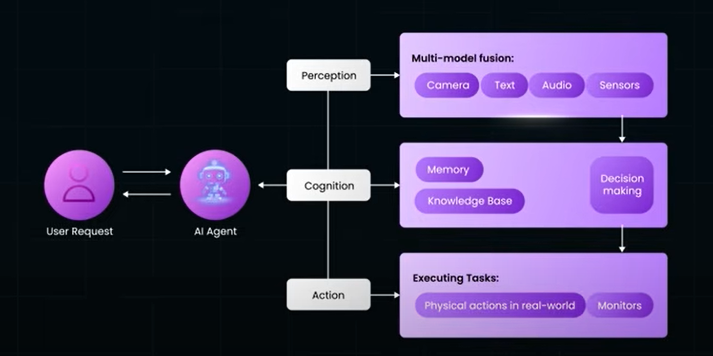
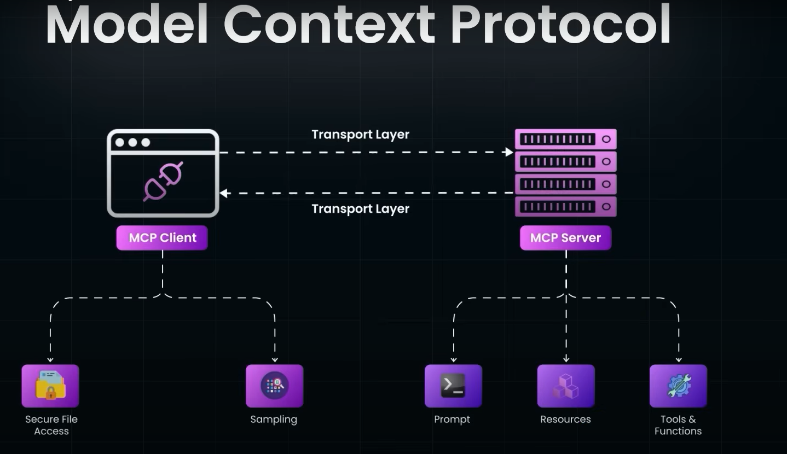

### Diff b/w a RAG Chatbot, Tool-Augmented and a Agentic AI

| **Feature**                   | **Agentic AI** 🧠                                 | **RAG Chatbot** 📚              | **Tool-Augmented Chatbot** 🛠️                 |
| ----------------------------- | ------------------------------------------------- | ------------------------------- | ---------------------------------------------- |
| **Core Behavior**             | Goal-oriented, autonomous                         | Passive, question-answering     | Reactive, uses tools based on prompts          |
| **Multi-step Planning**       | ✅ Yes                                             | ❌ No                            | ❌ No                                           |
| **Tool Usage**                | ✅ Yes (uses tools as needed)                      | ❌ No                            | ✅ Yes                                          |
| **External Knowledge Access** | ✅ Often integrated with tools or retrieval        | ✅ Retrieves documents or data   | ✅ May use APIs, databases, calculators, etc.   |
| **State & Memory**            | ✅ Maintains memory across steps/goals             | ❌ Stateless (per interaction)   | ❌ Typically stateless                          |
| **Autonomy**                  | ✅ Can act independently or proactively            | ❌ Fully user-driven             | ❌ Fully user-driven                            |
| **Task Decomposition**        | ✅ Breaks down tasks into sub-goals                | ❌ No                            | ❌ No                                           |
| **Interactivity**             | Multi-turn, stateful interactions                 | Single-turn or short-context    | Multi-turn (but still reactive)                |
| **Adaptability**              | ✅ Learns or adapts strategy mid-task              | ❌ Fixed response to input       | ❌ Tool selection only                          |
| **Example Use Case**          | Research + plan + execute (e.g., automate report) | Answer questions from documents | Check weather + convert units                  |
| **Complex Workflow Support**  | ✅ Yes                                             | ❌ No                            | ⚠️ Limited (if tool chaining is not supported) |
| **Initiates Actions**         | ✅ Yes (e.g., schedules meetings, monitors tasks)  | ❌ No                            | ❌ No                                           |
| **Goal Persistence**          | ✅ Tracks goals over time                          | ❌ None                          | ❌ None                                         |
| **Best For**                  | Automation, assistants, workflow orchestration    | Info lookup, Q\&A               | Data tasks, calculations, simple API use       |

### Diff b/w Gen AI and Agentic AI

`Gen AI` refers to AI systems (usually based on large language models or similar architectures) that can generate content such as:

Text (e.g., articles, stories, code)
Images (e.g., art, photos)
Audio or video (e.g., deepfakes, music)

They produce output in response to a prompt, typically without memory, planning, or autonomy.

`Agentic AI` is a broader concept, `Gen AI` is a subcomponent of it, Imagine Gen AI as the brain that can think and speak well, while Agentic AI is a robot assistant that uses that brain, plus tools and memory, to act in the world and achieve goals.

For example AI Agent in below diagram uses Gemini

### (MCP) Model Context Protocol

A pivotal integration standard that empowers AI agents to interact seamlessly with external tools, data sources, and systems.

At its core, MCP provides a client–server architecture:

`MCP Client:` The AI agent or application logic that issues structured requests (usually via JSON-RPC over HTTP).

`MCP Server:` The abstraction layer translating these requests into actual operations—handling API calls, authentication, data fetching, formatting, and normalization

MCP is not the “brain” behind Agentic AI, but rather the plumbing—the essential infrastructure that makes agentic AI practical, scalable, and intelligent in real-world environments.

### LLM's available

1.` GPT` by OpenAI

OpenAI – GPT-4o / GPT‑4.5 / o3 series: GPT-4o remains the top overall model, offering multimodal capabilities (text, image, audio) and a wide 128K token context window.

2. `Claude` by Anthropic

Claude 3.5 / 3.7 / 4 (Sonnet & Opus): Claude 4 Opus (May 2025) excels at complex reasoning and long-context processing

3. `Gemini` and `Gemma` by Google

Gemini (2.5 Pro, 2.0 Flash): Gemini 2.5 Pro offers an enormous 1 million token context window, high reasoning performance, and deep integration into Google’s ecosystem

A lightweight, open-source counterpart to Gemini. Gemma 3 (March 2025) is multimodal and optimized for single-GPU usage

4. `Grok` by X

Grok 3 - Released February 2025, Grok 3 features advanced reasoning, real-time web connectivity via DeepSearch, and competitive benchmark performance

5. `Nova Pro` by Amazon

A multimodal enterprise-grade model that rivals GPT-4o and Claude 3.5 Sonnet in performance.

6. `Qwen` by Alibaba

The Qwen series (latest Qwen 3 released July 2025) includes both dense and sparse models, supports input-output in multiple modalities, and handles up to 128K context

7. `R1` by DeepSeek

Released Jan–May 2025, this model emphasizes reasoning, efficient operation, and strong benchmark performance.

8. Others (Bloom, Falcon, Vicuna, GPT-NeoX, Mixtral & Magistral)

Whis is best? - the best LLM depends on what you value most:

| Your Priority                        | Recommended Models                                     | Why They Shine                                        |
| ------------------------------------ | ------------------------------------------------------ | ----------------------------------------------------- |
| **Overall Multimodal & Versatility** | GPT‑4o, Gemini 2.5 Pro                                 | Broad capability, multimodal, strong context handling |
| **Reasoning & Complex Tasks**        | Claude 4 Opus, Grok 3, OpenAI o3                       | Top reasoning benchmarks, structured thinking         |
| **Enterprise Safety & Reliability**  | Claude Sonnet, Gemini Flash                            | Ethical guardrails, predictable outputs               |
| **Open-Source Customization**        | LLaMA 3, Gemma 3, Qwen 3, DeepSeek R1, Mistral         | Flexibility, local deployment, cost control           |
| **Ultra-Long Context Needs**         | Gemini 2.5 Pro (1M tokens), LLaMA 4 Scout (10M tokens) | Handle massive documents or datasets                  |
| **Cost-Sensitive Use**               | LLaMA, DeepSeek, Mistral                               | Efficient and budget-friendly open-source options     |

Closed-Source LLMS

| **Model**          | **Developer**   | **Latest Version**           | **Key Strengths**                               | **Max Context** | **Multimodal**   | **Ideal For**                               |
| ------------------ | --------------- | ---------------------------- | ----------------------------------------------- | --------------- | ---------------- | ------------------------------------------- |
| **GPT-4o**         | OpenAI          | GPT-4o / GPT-4.5 / o3 series | Best overall performance, reasoning, multimodal | 128K            | ✅ Yes            | General purpose, creative, coding, pro chat |
| **Claude 4 Opus**  | Anthropic       | 4 Opus, 4 Sonnet, 3.5        | Superior reasoning, safe alignment              | 200K+           | ❌ No (text only) | Regulated industries, deep reasoning        |
| **Gemini 2.5 Pro** | Google DeepMind | 2.5 Pro, 2.0 Flash           | 1M context tokens, Google integration, fast     | 1M              | ✅ Yes            | Enterprise, academic, long docs             |
| **Grok 3**         | xAI (Elon Musk) | 3 (Feb 2025)                 | Real-time web, reasoning, humor                 | 128K            | ✅ Yes            | X platform, logic tasks, real-time search   |
| **Nova Pro**       | Amazon          | Nova Pro (2025)              | Enterprise-focused multimodal AI                | Unknown         | ✅ Yes            | Business, Amazon ecosystem                  |

Open-Source LLMs

| **Model**               | **Developer**             | **Latest Version**     | **Key Strengths**                                    | **Max Context** | **Multimodal**  | **Ideal For**                         |
| ----------------------- | ------------------------- | ---------------------- | ---------------------------------------------------- | --------------- | --------------- | ------------------------------------- |
| **LLaMA 3.3 / 4**       | Meta                      | 3.3, 4 Maverick, Scout | High performance, 70B–405B params, Scout: 10M tokens | 10M (Scout)     | ✅ Yes (LLaMA 4) | Research, customization, huge input   |
| **Gemma 3**             | Google                    | Gemma 3 (2025)         | Lightweight, fast, open-source Gemini alternative    | \~128K          | ✅ Yes           | Small-scale, GPU-limited environments |
| **Qwen 3 Series**       | Alibaba                   | Qwen 3 (July 2025)     | High multilingual & multimodal support               | 128K            | ✅ Yes           | Asian languages, multimodal apps      |
| **DeepSeek R1**         | DeepSeek                  | R1 (May 2025)          | Reasoning & logic, efficient & scalable              | 128K+           | ❌ No            | Local deployment, reasoning apps      |
| **Mistral / Magistral** | Mistral AI                | Magistral (June 2025)  | Mixture of Experts (MoE), strong open reasoning      | 65K–128K        | ❌ No            | Lightweight, scalable reasoning tasks |
| **Falcon 180B**         | TII (UAE)                 | Falcon 180B (2024+)    | Large param model with strong benchmark performance  | 128K+           | ❌ No            | Science, research, fine-tuning        |
| **GPT-NeoX / Bloom**    | EleutherAI / Hugging Face | NeoX-20B / Bloom       | Early open models, still used in research            | \~2048–16K      | ❌ No            | Educational use, experimentation      |

Best by use case

| **Use Case**                  | **Best Models**                          | **Why**                                             |
| ----------------------------- | ---------------------------------------- | --------------------------------------------------- |
| **Best Overall**              | GPT-4o, Gemini 2.5 Pro                   | Versatile, powerful, long-context, multimodal       |
| **Best for Reasoning**        | Claude 4 Opus, OpenAI o3, Grok 3         | High logical and mathematical reasoning             |
| **Multimodal Applications**   | GPT-4o, Gemini 2.5 Pro, Nova Pro         | Handle text, image, and audio                       |
| **Long Context Needs**        | Gemini 2.5 Pro (1M), LLaMA 4 Scout (10M) | Ideal for research, legal, and medical documents    |
| **Open-Source Use**           | LLaMA 3.3/4, Gemma 3, Qwen 3, Mistral    | Local hosting, fine-tuning, no vendor lock-in       |
| **Enterprise & Safe Outputs** | Claude Sonnet, Gemini Flash              | Highly aligned, safe for regulated industries       |
| **Cost-Conscious Deployment** | Mistral, DeepSeek, LLaMA 3               | Efficient and open; low infrastructure requirements |

### LLAMA 3.1

Meta’s latest evolution of its open‑source large language model

LLaMA 3.1 is the third-generation LLaMA model family introduced by Meta, officially launched on July 23, 2024

The largest and most capable is the `Llama 3.1 405B model`, which Meta trained on 405 billion parameters (hence "405B"). It launched with the Llama 3.1 update in July 2024 and made Llama the most capable open-source LLM in the world.

Meta released LLaMA 3.1 under an open‑source license. The model weights are freely available, allowing developers to run, fine‑tune, and customize the models without restrictions

### Frameworks available to build LLM appplications

| **Use Case**                         | **Best Framework Options**                             |
| ------------------------------------ | -------------------------------------------- |
| General-purpose pipelines            | LangChain, LlamaIndex                        |
| Retrieval-Augmented Generation (RAG) | Haystack, LlamaIndex, LangChain              |
| No-code prototyping                  | Flowise                                      |
| Multi-agent collaboration            | CrewAI, AutoGen, LangGraph                   |
| Declarative prompt design            | DSPy                                         |
| Tool-using agents                    | Transformers Agents, CrewAI, Semantic Kernel |
| Fast LLM apps in JS/TS               | SuperAgent, LangChain.js                     |
| Production-scale backend             | Haystack, Semantic Kernel, Griptape          |

### LangChain