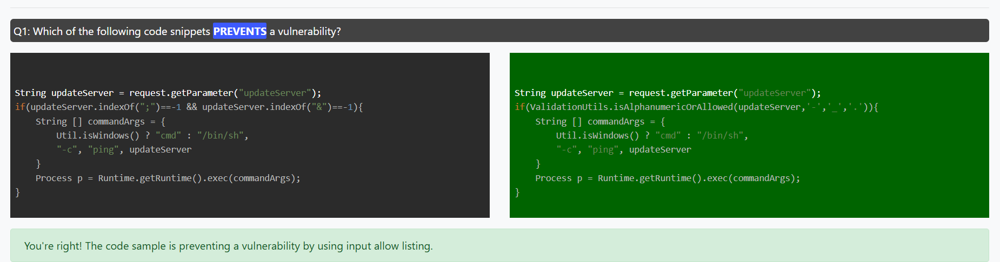
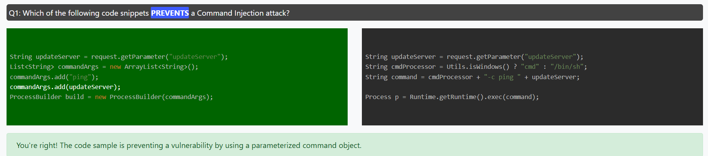
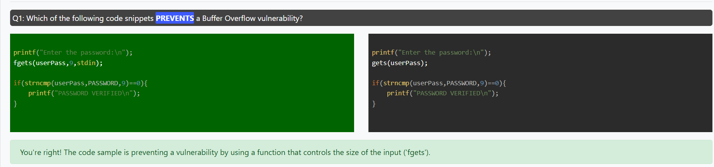
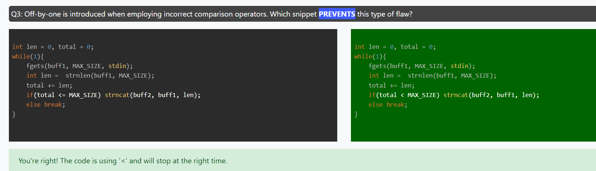
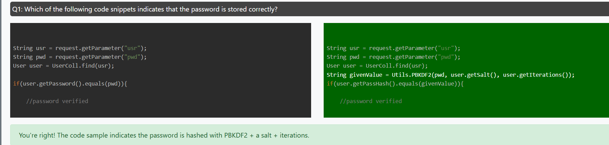

# Input Validation

### Allowlist/whitelist approach

It is important to note that a common mistake is to use deny lists for validation. For example an application will prevent symbols that are known to cause trouble. The weakness of this approach is that some symbols may be overlooked.




### Defined format strings

Always keep format strings fixed in the code, never from user input.

```
// ❌ Dangerous
printf(user_input);

// ✅ Safe
printf("%s", user_input);
```
```
// ❌ Dangerous: user controls the format string
String userInput = "%x %x %x";  
System.out.printf(userInput);

// ✅ Safe: keep format fixed
System.out.printf("%s", userInput);
```

### Avoiding unexpected specifiers (%n etc)

Avoid %n or unexpected format specifiers from user data, Strip out unexpected % symbols from user strings
```
// ❌ Dangerous if user provides "%n"
String userInput = "%n%n%n";
System.out.printf(userInput); // tries to write newlines 
```

### Output Encoding

HTML Encoding functions have to be called to turn hazardous HTML markup into safe strings., Most modern JavaScript frameworks such as Angular and React do this implicitly.

textContent (encodes special characters automatically)

Never use `innerHTML` with untrusted data. Always Use `.textContent` or `.innerText`.

If a developer must write their own function, they need to cover all HTML special characters:

Insecure Example (No HTML Encoding)
```
<!DOCTYPE html>
<html lang="en">
<head>
  <meta charset="UTF-8">
  <title>Insecure Example</title>
</head>
<body>
  <h2>Insecure Greeting</h2>
  <div id="greeting"></div>

  <script>
    // BAD: directly inject user input into innerHTML
    const params = new URLSearchParams(window.location.search);
    const name = params.get("name");
    document.getElementById("greeting").innerHTML = "Hello " + name;
  </script>
</body>
</html>

```

Secure HTML5 Example (with encoding / safe API)
```
<!DOCTYPE html>
<html lang="en">
<head>
  <meta charset="UTF-8">
  <title>Secure Example</title>
</head>
<body>
  <h2>Secure Greeting</h2>
  <div id="greeting"></div>

  <script>
    // GOOD: use textContent (encodes special characters automatically)
    const params = new URLSearchParams(window.location.search);
    const name = params.get("name") || "Guest";
    document.getElementById("greeting").textContent = "Hello " + name;
  </script>
</body>
</html>
```
If a developer must write their own function, they need to cover all HTML special characters:
```
<!DOCTYPE html>
<html lang="en">
<head>
  <meta charset="UTF-8">
  <title>Secure Custom Encode</title>
</head>
<body>
  <h2>Greeting</h2>
  <div id="greeting"></div>

  <script>
    // GOOD: properly escape all critical characters
    function secureEncode(str) {
      return str
        .replace(/&/g, "&amp;")
        .replace(/</g, "&lt;")
        .replace(/>/g, "&gt;")
        .replace(/"/g, "&quot;")
        .replace(/'/g, "&#39;");
    }

    const params = new URLSearchParams(window.location.search);
    const name = params.get("name") || "Guest";

    document.getElementById("greeting").innerHTML = "Hello " + secureEncode(name);
  </script>
</body>
</html>
```
```
import org.apache.commons.text.StringEscapeUtils;

public class SecureServlet extends HttpServlet {
    protected void doGet(HttpServletRequest request, HttpServletResponse response)
            throws ServletException, IOException {
        String userInput = request.getParameter("name");

        // GOOD: use a well-tested library
        String safeInput = StringEscapeUtils.escapeHtml4(userInput);

        PrintWriter out = response.getWriter();
        out.println("<p>Hello " + safeInput + "</p>");
    }
}
```
Python (Flask with MarkupSafe / Jinja2 auto-escaping)
```
from flask import Flask, request, render_template_string
from markupsafe import escape

app = Flask(__name__)

@app.route("/greet")
def greet():
    name = request.args.get("name", "")
    # GOOD: escape user input
    safe_name = escape(name)
    return f"<p>Hello {safe_name}</p>"
```
Or with Jinja2 templates:
```
<!-- Jinja2 auto-escapes by default -->
<p>Hello {{ name }}</p>
```


### Parameterized Statements

Parameterized Statements are used to prevent both SQL Injection and Command Injection vulnerabilities which are listed at the top of OWASP Top 10 Application Security Risks and MITRE Top 25 Most Dangerous Software Errors.



Insecure Example — JavaScript (Node.js with mysql)
```
// BAD: SQL query built by string concatenation
const mysql = require('mysql');
const connection = mysql.createConnection({host:'localhost', user:'root', password:'', database:'test'});

const username = req.query.username;  // user input from HTTP request
const password = req.query.password;

const query = "SELECT * FROM users WHERE username = '" + username + "' AND password = '" + password + "'";

connection.query(query, (err, results) => {
  if (err) throw err;
  console.log(results);
});
```

Secure Example — JavaScript (Node.js with mysql2 prepared statements)
```
// GOOD: parameterized query (placeholders + values)
const mysql = require('mysql2');
const connection = mysql.createConnection({host:'localhost', user:'root', password:'', database:'test'});

const username = req.query.username;
const password = req.query.password;

// Use ? placeholders, values passed separately
const query = "SELECT * FROM users WHERE username = ? AND password = ?";
connection.execute(query, [username, password], (err, results) => {
  if (err) throw err;
  console.log(results);
});
```

Insecure Example — Node.js (Command Injection)
```
// BAD: concatenating user input into a shell command
const { exec } = require('child_process');
const http = require('http');
const url = require('url');

http.createServer((req, res) => {
  const queryObject = url.parse(req.url, true).query;
  const filename = queryObject.file; // user-controlled input

  // Dangerous: unsanitized input in shell command
  exec('cat ' + filename, (err, stdout, stderr) => {
    if (err) {
      res.end('Error: ' + stderr);
    } else {
      res.end(stdout);
    }
  });
}).listen(3000);
```
Attack - http://localhost:3000/?file=notes.txt; rm -rf /

Secure Example — Node.js (No Injection)
```
// GOOD: avoids shell by passing arguments as an array
const { execFile } = require('child_process');
const http = require('http');
const url = require('url');
const path = require('path');

http.createServer((req, res) => {
  const queryObject = url.parse(req.url, true).query;
  let filename = queryObject.file;

  // Restrict to a safe directory (whitelist)
  const safeBase = '/var/data/files';
  filename = path.basename(filename); // strip paths
  const safePath = path.join(safeBase, filename);

  execFile('cat', [safePath], (err, stdout, stderr) => {
    if (err) {
      res.end('Error: ' + stderr);
    } else {
      res.end(stdout);
    }
  });
}).listen(3000);
```

### File Handling

file handling is one of the biggest attack surfaces in web applications. If you take user input (like a filename or path) and use it directly, you risk:

- Command Injection → input injected into shell command (cat, rm, etc.)
- Directory Traversal → attacker reads /etc/passwd by using ../../
- Remote File Inclusion (RFI) → attacker tricks your app into fetching code from another server

To avoid always Restrict to a safe base directory

Insecure Example (Node.js)
```
const fs = require('fs');
const http = require('http');
const url = require('url');

http.createServer((req, res) => {
  const queryObject = url.parse(req.url, true).query;
  const filename = queryObject.file; // User input

  // BAD: user input directly in filesystem path
  fs.readFile(filename, 'utf8', (err, data) => {
    if (err) {
      res.end("Error reading file.");
    } else {
      res.end(data);
    }
  });
}).listen(3000);
```

Secure Example (Node.js)
- Restrict to a safe base directory

```
// GOOD: avoids shell by passing arguments as an array
const { execFile } = require('child_process');
const http = require('http');
const url = require('url');
const path = require('path');

http.createServer((req, res) => {
  const queryObject = url.parse(req.url, true).query;
  let filename = queryObject.file;

  // Restrict to a safe directory (whitelist)
  const safeBase = '/var/data/files';
  filename = path.basename(filename); // strip paths
  const safePath = path.join(safeBase, filename);

  execFile('cat', [safePath], (err, stdout, stderr) => {
    if (err) {
      res.end('Error: ' + stderr);
    } else {
      res.end(stdout);
    }
  });
}).listen(3000);
```
Another secure example
```
const fs = require('fs');
const http = require('http');
const url = require('url');
const path = require('path');

http.createServer((req, res) => {
  const queryObject = url.parse(req.url, true).query;
  let filename = queryObject.file;

  // Restrict to a safe base directory
  const safeBase = path.resolve("user_files");
  const requestedPath = path.join(safeBase, path.basename(filename)); // strip path traversal

  // Check that the path is still inside safeBase
  if (!requestedPath.startsWith(safeBase)) {
    res.writeHead(400);
    return res.end("Invalid file path.");
  }

  // Only allow specific file extensions
  if (!/\.txt$/i.test(requestedPath)) {
    res.writeHead(400);
    return res.end("Invalid file type.");
  }

  fs.readFile(requestedPath, 'utf8', (err, data) => {
    if (err) {
      res.end("Error reading file.");
    } else {
      res.end(data);
    }
  });
}).listen(3000);
```

### File Upload

If file uploads are not handled securely, attackers can perform:

- Arbitrary File Upload → upload a webshell (.jsp, .php, .js) and execute code.
- Directory Traversal → save file outside intended folder (../../etc/passwd).
- Malicious File Type Upload → upload malware disguised as an image.
- Command Injection → if uploaded file names are passed to shell commands.

Attackers often bypass simple extension checks using:

- Double extensions → evil.php.jpg
- Uppercase/mixed case → evil.PHP
- Hidden Unicode characters → evil.php%20 or evil.pℎp (homoglyph)
- Null byte injection → evil.php\0.jpg (in old parsers)
- MIME type mismatch → real PHP file but Content-Type: image/jpeg


To avoid
- Generate safe random filename, UUID-based renaming → no user-controlled filenames.
- Only allow specific mime types (Use Tika or magic number inspection for real MIME.)
- Double-check actual content type and reject suspicious file
- Limit file size
- Reject if extension not in whitelist
- Convert extension to lowercase (blocks .JPG.php tricks).
- scan for malicious content
- Store outside webroot → prevents direct execution.
-  strip path to prevent directory traversal

Insecure Example (No Content Check)
```
// BAD: only checks extension, doesn’t check file contents
const express = require('express');
const multer = require('multer');
const app = express();

const upload = multer({ dest: 'uploads/' });

app.post('/upload', upload.single('file'), (req, res) => {
  res.send(`File uploaded: ${req.file.originalname}`);
});

app.listen(3000);
```
Insecure Example (Java Servlet)
```
@WebServlet("/upload")
public class InsecureUploadServlet extends HttpServlet {
    protected void doPost(HttpServletRequest request, HttpServletResponse response)
            throws ServletException, IOException {

        DiskFileItemFactory factory = new DiskFileItemFactory();
        ServletFileUpload upload = new ServletFileUpload(factory);

        try {
            List<FileItem> items = upload.parseRequest(request);
            for (FileItem item : items) {
                if (!item.isFormField()) {
                    // BAD: trust user-supplied filename
                    String fileName = item.getName();

                    // BAD: save directly under webroot
                    File uploadedFile = new File(getServletContext().getRealPath("/") + fileName);
                    item.write(uploadedFile);

                    response.getWriter().println("Uploaded: " + fileName);
                }
            }
        } catch (Exception e) {
            throw new ServletException("Upload failed", e);
        }
    }
}
```
Secure Spring Boot Example
```
import org.apache.tika.Tika;
import org.springframework.core.io.*;
import org.springframework.http.*;
import org.springframework.web.bind.annotation.*;
import org.springframework.web.multipart.MultipartFile;

import java.io.*;
import java.nio.file.*;
import java.util.*;

@RestController
@RequestMapping("/files")
public class SecureFileController {

    private static final Path UPLOAD_DIR = Paths.get("/var/app/uploads"); // outside webroot
    private static final long MAX_FILE_SIZE = 2 * 1024 * 1024; // 2MB
    private static final Set<String> ALLOWED_EXTENSIONS =
            Set.of(".jpg", ".jpeg", ".png", ".gif", ".pdf");
    private static final Set<String> ALLOWED_MIME =
            Set.of("image/jpeg", "image/png", "image/gif", "application/pdf");

    private final Tika tika = new Tika();

    @PostMapping("/upload")
    public ResponseEntity<String> upload(@RequestParam("file") MultipartFile file) throws IOException {
        if (file.isEmpty()) {
            return ResponseEntity.badRequest().body("Empty file.");
        }

        if (file.getSize() > MAX_FILE_SIZE) {
            return ResponseEntity.badRequest().body("File too large.");
        }

        // Normalize and validate extension
        String originalName = Paths.get(file.getOriginalFilename()).getFileName().toString();
        String ext = originalName.substring(originalName.lastIndexOf(".")).toLowerCase();
        if (!ALLOWED_EXTENSIONS.contains(ext)) {
            return ResponseEntity.badRequest().body("Invalid file type.");
        }

        // Safe random filename
        String safeName = UUID.randomUUID().toString() + ext;
        Path targetPath = UPLOAD_DIR.resolve(safeName).normalize();

        // Save file temporarily
        Files.copy(file.getInputStream(), targetPath, StandardCopyOption.REPLACE_EXISTING);

        // Validate MIME type with Apache Tika
        String detectedType = tika.detect(targetPath);
        if (!ALLOWED_MIME.contains(detectedType)) {
            Files.deleteIfExists(targetPath);
            return ResponseEntity.badRequest().body("Invalid content.");
        }

        // Optionally: run AV scan (ClamAV / commercial scanner)
        // e.g. call external process or API before final acceptance

        return ResponseEntity.ok("Uploaded securely as: " + safeName);
    }

    @GetMapping("/download/{filename}")
    public ResponseEntity<Resource> download(@PathVariable String filename) throws IOException {
        // Normalize to prevent directory traversal
        String safeName = Paths.get(filename).getFileName().toString();
        Path filePath = UPLOAD_DIR.resolve(safeName).normalize();

        if (!Files.exists(filePath)) {
            return ResponseEntity.notFound().build();
        }

        // Extension check again (defense in depth)
        String ext = safeName.substring(safeName.lastIndexOf(".")).toLowerCase();
        if (!ALLOWED_EXTENSIONS.contains(ext)) {
            return ResponseEntity.status(HttpStatus.FORBIDDEN).build();
        }

        String mimeType = Files.probeContentType(filePath);
        if (mimeType == null) {
            mimeType = "application/octet-stream";
        }

        Resource resource = new UrlResource(filePath.toUri());
        return ResponseEntity.ok()
                .contentType(MediaType.parseMediaType(mimeType))
                .header(HttpHeaders.CONTENT_DISPOSITION, "attachment; filename=\"" + safeName + "\"")
                .body(resource);
    }
}
```
Secure Example (Java Servlet with Checks)
```
import java.io.*;
import java.nio.file.*;
import java.util.*;
import javax.servlet.*;
import javax.servlet.annotation.*;
import javax.servlet.http.*;

import org.apache.commons.fileupload.*;
import org.apache.commons.fileupload.disk.*;
import org.apache.commons.fileupload.servlet.*;
import org.apache.tika.Tika;

@WebServlet("/upload")
@MultipartConfig
public class SecureUploadServlet extends HttpServlet {
    private static final long MAX_FILE_SIZE = 2 * 1024 * 1024; // 2 MB
    private static final String UPLOAD_DIR = "/var/app/uploads"; // outside webroot
    private static final Set<String> ALLOWED_EXTENSIONS =
            Set.of(".jpg", ".jpeg", ".png", ".gif", ".pdf");
    private static final Set<String> ALLOWED_MIME =
            Set.of("image/jpeg", "image/png", "image/gif", "application/pdf");

    protected void doPost(HttpServletRequest request, HttpServletResponse response)
            throws ServletException, IOException {

        DiskFileItemFactory factory = new DiskFileItemFactory();
        ServletFileUpload upload = new ServletFileUpload(factory);
        upload.setFileSizeMax(MAX_FILE_SIZE);

        Tika tika = new Tika(); // for MIME detection

        try {
            List<FileItem> items = upload.parseRequest(request);
            for (FileItem item : items) {
                if (!item.isFormField()) {
                    // Normalize filename (strip paths)
                    String originalName = Paths.get(item.getName()).getFileName().toString();
                    String ext = originalName.substring(originalName.lastIndexOf(".")).toLowerCase();

                    // Validate extension
                    if (!ALLOWED_EXTENSIONS.contains(ext)) {
                        response.sendError(HttpServletResponse.SC_BAD_REQUEST, "Invalid file type.");
                        continue;
                    }

                    // Generate safe random filename
                    String safeName = UUID.randomUUID().toString() + ext;
                    File uploadedFile = new File(UPLOAD_DIR, safeName);

                    // Save temporarily
                    item.write(uploadedFile);

                    // Validate MIME type with Apache Tika (content-based)
                    String detectedType = tika.detect(uploadedFile);
                    if (!ALLOWED_MIME.contains(detectedType)) {
                        uploadedFile.delete();
                        response.sendError(HttpServletResponse.SC_BAD_REQUEST, "Invalid content.");
                        continue;
                    }

                    // Run antivirus scan (ClamAV example)
                    Process scan = new ProcessBuilder("clamscan", uploadedFile.getAbsolutePath()).start();
                    try (BufferedReader reader = new BufferedReader(new InputStreamReader(scan.getInputStream()))) {
                        String line;
                        while ((line = reader.readLine()) != null) {
                            if (line.contains("FOUND")) {
                                uploadedFile.delete();
                                response.sendError(HttpServletResponse.SC_BAD_REQUEST, "Malicious file detected.");
                                return;
                            }
                        }
                    }

                    response.getWriter().println("File securely uploaded as: " + safeName);
                }
            }
        } catch (FileUploadBase.SizeLimitExceededException e) {
            response.sendError(HttpServletResponse.SC_BAD_REQUEST, "File too large.");
        } catch (Exception e) {
            throw new ServletException("Upload failed", e);
        }
    }
}
```

Secure Example (Node.js + Express)
```
const express = require('express');
const multer  = require('multer');
const path = require('path');
const fs = require('fs');

const app = express();

// Restrict storage location
const upload = multer({
  storage: multer.diskStorage({
    destination: function (req, file, cb) {
      cb(null, 'uploads/'); // dedicated safe folder
    },
    filename: function (req, file, cb) {
      // Generate safe random filename, keep extension
      const safeName = Date.now() + '-' + Math.round(Math.random() * 1E9);
      cb(null, safeName + path.extname(file.originalname).toLowerCase());
    }
  }),
  limits: { fileSize: 2 * 1024 * 1024 }, // 2MB max
  fileFilter: function (req, file, cb) {
    // Only allow specific mime types
    const allowed = ['.png', '.jpg', '.jpeg', '.gif', '.txt', '.pdf'];
    const ext = path.extname(file.originalname).toLowerCase();
    if (!allowed.includes(ext)) {
      return cb(new Error('Invalid file type'), false);
    }
    cb(null, true);
  }
});

app.post('/upload', upload.single('file'), (req, res) => {
  res.send(`File securely uploaded as ${req.file.filename}`);
});

app.listen(3000);
```
Secure Example (with Content Scanning)
```
const express = require('express');
const multer = require('multer');
const path = require('path');
const fs = require('fs');
const { exec } = require('child_process');

const app = express();

const upload = multer({
  storage: multer.diskStorage({
    destination: function (req, file, cb) {
      cb(null, 'uploads/');
    },
    filename: function (req, file, cb) {
      const safeName = Date.now() + '-' + Math.round(Math.random() * 1E9);
      cb(null, safeName + path.extname(file.originalname).toLowerCase());
    }
  }),
  limits: { fileSize: 2 * 1024 * 1024 }, // 2 MB max
  fileFilter: function (req, file, cb) {
    const allowed = ['.png', '.jpg', '.jpeg', '.gif', '.txt', '.pdf'];
    const ext = path.extname(file.originalname).toLowerCase();
    if (!allowed.includes(ext)) {
      return cb(new Error('Invalid file type'), false);
    }
    cb(null, true);
  }
});

app.post('/upload', upload.single('file'), (req, res) => {
  const filePath = req.file.path;

  // Run antivirus scan (ClamAV example)
  exec(`clamscan ${filePath}`, (err, stdout, stderr) => {
    if (err) {
      // If scan fails or detects virus
      fs.unlinkSync(filePath); // delete the file
      return res.status(400).send("File rejected: malicious content detected.");
    }

    if (stdout.includes("Infected files: 1")) {
      fs.unlinkSync(filePath); // delete the file
      return res.status(400).send("File rejected: virus detected.");
    }

    // If clean
    res.send(`File securely uploaded as ${req.file.filename}`);
  });
});

app.listen(3000, () => console.log("Server running on http://localhost:3000"));
```
Secure Example (Node.js — robust checks)
```
const express = require('express');
const multer  = require('multer');
const path = require('path');
const fs = require('fs');
const FileType = require('file-type'); // npm install file-type

const app = express();

// Storage settings
const storage = multer.diskStorage({
  destination: (req, file, cb) => cb(null, 'uploads/'),
  filename: (req, file, cb) => {
    // Always rename file to safe random name
    const safeName = Date.now() + '-' + Math.round(Math.random() * 1E9);
    cb(null, safeName + path.extname(file.originalname).toLowerCase());
  }
});

const upload = multer({
  storage,
  limits: { fileSize: 2 * 1024 * 1024 }, // 2 MB
  fileFilter: (req, file, cb) => {
    const allowedExt = ['.jpg', '.jpeg', '.png', '.gif', '.pdf'];
    const ext = path.extname(file.originalname).toLowerCase();

    // Reject if extension not in whitelist
    if (!allowedExt.includes(ext)) {
      return cb(new Error('Invalid extension'), false);
    }

    cb(null, true);
  }
});

app.post('/upload', upload.single('file'), async (req, res) => {
  try {
    // Double-check actual content type (magic number)
    const filePath = req.file.path;
    const fileType = await FileType.fromFile(filePath);

    const allowedMime = ['image/jpeg', 'image/png', 'image/gif', 'application/pdf'];
    if (!fileType || !allowedMime.includes(fileType.mime)) {
      fs.unlinkSync(filePath); // delete suspicious file
      return res.status(400).send("Malicious file detected and removed.");
    }

    res.send(`File securely uploaded as ${req.file.filename}`);
  } catch (err) {
    return res.status(500).send("Upload error");
  }
});

app.listen(3000, () => console.log("Server running at http://localhost:3000"));
```

### File Download

Uploading safely is only half the story. You also need to serve/download uploaded files securely

To Prevent
- Normalize filename → Paths.get(...).getFileName() removes ../ traversal
- Check extension whitelist, Extension whitelist → only serve .jpg, .png, .pdf, etc.
- Detect MIME type safely
- Force download → `Content-Disposition: attachment` prevents inline execution
- Serve outside webroot → prevents RFI

What Content-Disposition does - Normally, if you serve a file like an .html or .js file, the browser might render or execute it (e.g., HTML is displayed, JavaScript is run). If you want to prevent that (for security reasons, like avoiding cross-site scripting (XSS)), you can tell the browser: "Don’t try to display this file—treat it as a downloadable attachment.".

Using Content-Disposition: attachment ensures that potentially dangerous files (HTML, JS, SVG, etc.) are downloaded safely instead of executed in the browser

Insecure Example — Direct File Access
```
@WebServlet("/download")
public class InsecureDownloadServlet extends HttpServlet {
    private static final String UPLOAD_DIR = "/var/app/uploads";

    protected void doGet(HttpServletRequest request, HttpServletResponse response)
            throws IOException {
        String filename = request.getParameter("file");

        // BAD: directly concatenate user input into path
        File file = new File(UPLOAD_DIR, filename);

        if (!file.exists()) {
            response.sendError(HttpServletResponse.SC_NOT_FOUND);
            return;
        }

        // BAD: browser may execute malicious content (e.g., .jsp, .html)
        Files.copy(file.toPath(), response.getOutputStream());
    }
}
```
Insecure Spring Boot Example
```
@RestController
@RequestMapping("/files")
public class InsecureFileController {

    private static final String UPLOAD_DIR = "uploads/";

    @PostMapping("/upload")
    public String upload(@RequestParam("file") MultipartFile file) throws IOException {
        // BAD: trust user filename, no validation
        Path path = Paths.get(UPLOAD_DIR + file.getOriginalFilename());
        Files.copy(file.getInputStream(), path, StandardCopyOption.REPLACE_EXISTING);
        return "Uploaded: " + file.getOriginalFilename();
    }

    @GetMapping("/download")
    public ResponseEntity<Resource> download(@RequestParam("file") String filename) throws IOException {
        // BAD: no normalization, vulnerable to ../ traversal
        Path path = Paths.get(UPLOAD_DIR, filename);
        Resource resource = new UrlResource(path.toUri());
        return ResponseEntity.ok().body(resource);
    }
}
```
Secure Example — Safe File Download Servlet
```
import java.io.*;
import java.nio.file.*;
import java.util.*;
import javax.servlet.*;
import javax.servlet.annotation.*;
import javax.servlet.http.*;

@WebServlet("/download")
public class SecureDownloadServlet extends HttpServlet {
    private static final String UPLOAD_DIR = "/var/app/uploads";
    private static final Set<String> ALLOWED_EXTENSIONS =
            Set.of(".jpg", ".jpeg", ".png", ".gif", ".pdf");

    protected void doGet(HttpServletRequest request, HttpServletResponse response)
            throws IOException {
        String filename = request.getParameter("file");
        if (filename == null) {
            response.sendError(HttpServletResponse.SC_BAD_REQUEST, "File parameter missing.");
            return;
        }

        // Normalize filename to prevent traversal
        String safeName = Paths.get(filename).getFileName().toString();
        File file = new File(UPLOAD_DIR, safeName);

        if (!file.exists()) {
            response.sendError(HttpServletResponse.SC_NOT_FOUND);
            return;
        }

        // Check extension whitelist
        String ext = safeName.substring(safeName.lastIndexOf(".")).toLowerCase();
        if (!ALLOWED_EXTENSIONS.contains(ext)) {
            response.sendError(HttpServletResponse.SC_FORBIDDEN, "Invalid file type.");
            return;
        }

        // Detect MIME type safely
        String mimeType = Files.probeContentType(file.toPath());
        if (mimeType == null) {
            mimeType = "application/octet-stream"; // fallback
        }

        // Force download (prevent execution in browser)
        response.setContentType(mimeType);
        response.setHeader("Content-Disposition", "attachment; filename=\"" + safeName + "\"");
        response.setContentLengthLong(file.length());

        try (InputStream in = new FileInputStream(file);
             OutputStream out = response.getOutputStream()) {
            byte[] buffer = new byte[8192];
            int bytesRead;
            while ((bytesRead = in.read(buffer)) != -1) {
                out.write(buffer, 0, bytesRead);
            }
        }
    }
}
```
Secure Spring Boot Example
```
import org.apache.tika.Tika;
import org.springframework.core.io.*;
import org.springframework.http.*;
import org.springframework.web.bind.annotation.*;
import org.springframework.web.multipart.MultipartFile;

import java.io.*;
import java.nio.file.*;
import java.util.*;

@RestController
@RequestMapping("/files")
public class SecureFileController {

    private static final Path UPLOAD_DIR = Paths.get("/var/app/uploads"); // outside webroot
    private static final long MAX_FILE_SIZE = 2 * 1024 * 1024; // 2MB
    private static final Set<String> ALLOWED_EXTENSIONS =
            Set.of(".jpg", ".jpeg", ".png", ".gif", ".pdf");
    private static final Set<String> ALLOWED_MIME =
            Set.of("image/jpeg", "image/png", "image/gif", "application/pdf");

    private final Tika tika = new Tika();

    @PostMapping("/upload")
    public ResponseEntity<String> upload(@RequestParam("file") MultipartFile file) throws IOException {
        if (file.isEmpty()) {
            return ResponseEntity.badRequest().body("Empty file.");
        }

        if (file.getSize() > MAX_FILE_SIZE) {
            return ResponseEntity.badRequest().body("File too large.");
        }

        // Normalize and validate extension
        String originalName = Paths.get(file.getOriginalFilename()).getFileName().toString();
        String ext = originalName.substring(originalName.lastIndexOf(".")).toLowerCase();
        if (!ALLOWED_EXTENSIONS.contains(ext)) {
            return ResponseEntity.badRequest().body("Invalid file type.");
        }

        // Safe random filename
        String safeName = UUID.randomUUID().toString() + ext;
        Path targetPath = UPLOAD_DIR.resolve(safeName).normalize();

        // Save file temporarily
        Files.copy(file.getInputStream(), targetPath, StandardCopyOption.REPLACE_EXISTING);

        // Validate MIME type with Apache Tika
        String detectedType = tika.detect(targetPath);
        if (!ALLOWED_MIME.contains(detectedType)) {
            Files.deleteIfExists(targetPath);
            return ResponseEntity.badRequest().body("Invalid content.");
        }

        // Optionally: run AV scan (ClamAV / commercial scanner)
        // e.g. call external process or API before final acceptance

        return ResponseEntity.ok("Uploaded securely as: " + safeName);
    }

    @GetMapping("/download/{filename}")
    public ResponseEntity<Resource> download(@PathVariable String filename) throws IOException {
        // Normalize to prevent directory traversal
        String safeName = Paths.get(filename).getFileName().toString();
        Path filePath = UPLOAD_DIR.resolve(safeName).normalize();

        if (!Files.exists(filePath)) {
            return ResponseEntity.notFound().build();
        }

        // Extension check again (defense in depth)
        String ext = safeName.substring(safeName.lastIndexOf(".")).toLowerCase();
        if (!ALLOWED_EXTENSIONS.contains(ext)) {
            return ResponseEntity.status(HttpStatus.FORBIDDEN).build();
        }

        String mimeType = Files.probeContentType(filePath);
        if (mimeType == null) {
            mimeType = "application/octet-stream";
        }

        Resource resource = new UrlResource(filePath.toUri());
        return ResponseEntity.ok()
                .contentType(MediaType.parseMediaType(mimeType))
                .header(HttpHeaders.CONTENT_DISPOSITION, "attachment; filename=\"" + safeName + "\"")
                .body(resource);
    }
}
```

# Memory Utilization

Memory related vulnerabilities are very dangerous. To prevent such vulnerabilities programmers can employ safe memory management practices such as:

- Functions that control the amount of data read into the memory
- Input and input size validation
- Using constants for buffer sizes
- Paying attention to comparison operators while reading into the memory
- Avoiding input in a format string

### Defined input size

Buffer overflows (e.g., writing beyond allocated memory) - Always limit the maximum size, to prevent memory related issues



C example
```
#include <stdio.h>

int main(void) {
    const size_t MAX_LEN = 50;
    char buf[MAX_LEN];

    // ❌ Unsafe: no limit, may overflow
    // scanf("%s", buf);

    // ✅ Safe: limit input size to leave room for '\0'
    scanf("%49s", buf);  

    printf("You entered: %s\n", buf);
    return 0;
}

```
Java example - (Java doesn’t have raw buffer overflows, but incorrect size checks can still lead to memory issues.)
```
String userInput = scanner.nextLine();

// ❌ Unsafe: no length check, could blow up memory
System.out.printf("%s", userInput);

// ✅ Safe: restrict size
if (userInput.length() > 1000) {
    throw new IllegalArgumentException("Input too long!");
}
System.out.printf("%s", userInput);
```
```
// ✅ Safe input reading
Scanner scanner = new Scanner(System.in);
String userInput = scanner.nextLine();
```

### Correct use of Comparison Operator

This matters a lot when preventing overflows (in C) or memory exhaustion (in Java).
When reading into a buffer (C, C++) or allocating memory for input (Java, C#):

- If you use <= instead of <, or forget to subtract one for the null terminator in C, you can allow one extra byte → buffer overflow.
- If you forget to check the upper bound at all, input might overwrite memory or eat all available memory.
- Off-by-one mistakes in loops (i <= size instead of i < size) often cause out-of-bounds reads/writes.



# Unauthorized Access

### Direct object reference

# Cryptographic Failures

### Insecure password storage

Using one-way salted hashes with multiple iterations to store passwords

Why bad: no salt, single fast hash → attackers can precompute and brute force quickly.

Non-secure (bad)
```
# BAD: unsalted, single-round hash (vulnerable to rainbow tables and fast brute force)
import hashlib

def store_password_bad(password):
    digest = hashlib.sha256(password.encode('utf-8')).hexdigest()   # no salt, one round
    # store digest in DB
    return digest
```

Secure (good) — Python (PBKDF2)
```
# GOOD: PBKDF2 with per-user salt and many iterations; store salt, iterations, algo, and derived key
import os, hashlib, base64

def hash_password(password: str, iterations: int = 200_000) -> str:
    salt = os.urandom(16)  # 128-bit salt
    dk = hashlib.pbkdf2_hmac('sha256', password.encode(), salt, iterations, dklen=32)
    # store an encoding that includes algorithm, iterations, salt and derived key
    return f"pbkdf2_sha256${iterations}${base64.b64encode(salt).decode()}${base64.b64encode(dk).decode()}"

def verify_password(stored: str, candidate: str) -> bool:
    algo, iters_s, salt_b64, dk_b64 = stored.split('$')
    iterations = int(iters_s)
    salt = base64.b64decode(salt_b64)
    expected = base64.b64decode(dk_b64)
    derived = hashlib.pbkdf2_hmac('sha256', candidate.encode(), salt, iterations, dklen=len(expected))
    # constant-time comparison
    return hashlib.compare_digest(derived, expected)
```


### Insecure Key storage

Why bad: keys stored on disk or in source are easy to exfiltrate; no access control / rotation / audit.

Non-secure (bad)
```
# BAD: storing raw key in plaintext file or in code
# secret_key.txt contains the symmetric key in plaintext — anyone with filesystem access can read it.

with open('/etc/myapp/secret_key.txt', 'rb') as f:
    key = f.read()

# Use key directly — no access controls, no auditing
```

Why good: data key is generated server-side by KMS and the encrypted data key (ciphertext) is stored alongside the ciphertext. KMS controls access, provides audit logs, key rotation, and you never store raw long-term keys yourself.

Secure (good) — Envelope encryption with AWS KMS (Python, boto3)
```
# GOOD: get a data key from KMS, use it to encrypt data locally, store only the encrypted data key (ciphertext_blob)
# Requires: IAM role/policy that restricts kms:GenerateDataKey & kms:Decrypt to authorized principals
import boto3
from cryptography.hazmat.primitives.ciphers.aead import AESGCM

kms = boto3.client('kms', region_name='us-west-2')  # use appropriate region/config

def encrypt_with_kms(plaintext: bytes, kms_key_id: str):
    # Generate a data key (plain + encrypted)
    resp = kms.generate_data_key(KeyId=kms_key_id, KeySpec='AES_256')
    plaintext_data_key = resp['Plaintext']        # raw data key (in-memory only)
    encrypted_data_key = resp['CiphertextBlob']   # encrypted under KMS key (store this)

    # Use data key to encrypt data (AES-GCM)
    aesgcm = AESGCM(plaintext_data_key)
    nonce = os.urandom(12)
    ct = aesgcm.encrypt(nonce, plaintext, associated_data=None)

    # wipe plaintext_data_key ASAP from memory if possible (overwrite)
    # store: nonce || ct  and encrypted_data_key in DB/storage
    return {
        'encrypted_payload': nonce + ct,
        'encrypted_data_key': encrypted_data_key
    }

def decrypt_with_kms(encrypted_payload: bytes, encrypted_data_key: bytes):
    # Ask KMS to decrypt the data key (requires permissions & audited)
    resp = kms.decrypt(CiphertextBlob=encrypted_data_key)
    plaintext_data_key = resp['Plaintext']
    nonce = encrypted_payload[:12]
    ct = encrypted_payload[12:]
    aesgcm = AESGCM(plaintext_data_key)
    plaintext = aesgcm.decrypt(nonce, ct, associated_data=None)
    return plaintext
```

# Logging

### Safe Logging Framework

Prefer logging frameworks (java.util.logging, SLF4J, Log4j2) which separate format strings from data.

```
// ✅ Using SLF4J (safe because {} placeholders aren’t format strings)
logger.info("User input: {}", userInput);
```