**Getting Started With Azure**

You need to create an Azure account, and a subscription will be created for you. After you've created an Azure account, you're free to create additional subscriptions. For example, your company might use a single Azure account for your business and separate subscriptions for development, marketing, and sales departments. After you've created an Azure subscription, you can start creating Azure resources within each subscription.

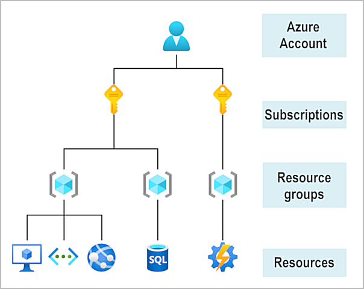

**Azure Physical Infrastructure**

1. Datacenters

The datacenters are the same as large corporate datacenters. They’re facilities with resources arranged in racks, with dedicated power, cooling, and networking infrastructure. Datacenters are grouped into Azure Regions or Azure Availability Zones that are designed to help you achieve resiliency and reliability for your business-critical workloads.

2. Regions

A region is a geographical area on the planet that contains at least one, but potentially multiple datacenters that are nearby and networked together with a low-latency network.

3. Availability Zones

Availability zones are physically separate one or more datacenters within an Azure region.  If one zone goes down, the other continues working. Availability zones are connected through high-speed, private fiber-optic networks.

4. Region Pairs

Most Azure regions are paired with another region within the same geography (such as US, Europe, or Asia) at least 300 miles away. This approach allows for the replication of resources across a geography that helps reduce the likelihood of interruptions because of events such as natural disasters, civil unrest, power outages, or physical network outages that affect an entire region.

**Azure Management Infrastructure**

1. Azure resource

A resource is the basic building block of Azure. Anything you create, provision, deploy, etc. is a resource. Virtual Machines (VMs), virtual networks, databases, cognitive services, etc. are all considered resources within Azure.

2. Resource Groups

Resource groups are simply groupings of resources. When you create a resource, you’re required to place it into a resource group. While a resource group can contain many resources, a single resource can only be in one resource group at a time. Additionally, resource groups can't be nested, meaning you can’t put resource group B inside of resource group A.

3. Azure subscriptions

Using Azure requires an Azure subscription, subscriptions allow you to logically organize your resource groups and facilitate billing. An Azure subscription links to an Azure account, which is an identity in Microsoft Entra ID or in a directory that Microsoft Entra ID trusts. An account can have multiple subscriptions, but it’s only required to have one. In a multi-subscription account, you can use the subscriptions to configure different billing models and apply different access-management policies. Similar to using resource groups to separate resources by function or access, you might want to create additional subscriptions for a separate development/testing enviornment, Organizational structures, or billing management purposes.


4. Azure management groups

If you have many subscriptions, you might need a way to efficiently manage access, policies, and compliance for those subscriptions. Azure management groups provide a level of scope above subscriptions. You organize subscriptions into containers called management groups and apply governance conditions to the management groups. All subscriptions within a management group automatically inherit the conditions applied to the management group, the same way that resource groups inherit settings from subscriptions and resources inherit from resource groups.

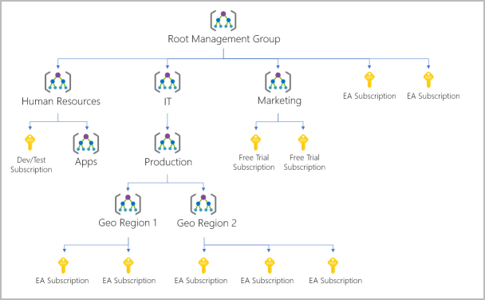


**Ways to interact with Azure**

- Azure Portal (GUI)
- Azure Powershell module and Azure CLI (command line interaction)
- Azure Cloud Shell (web based command line interaction)

**Azure Advisor**

Azure Advisor is a free service built into Azure that provides recommendations on high availability, security, performance, operational excellence, and cost. Advisor analyzes your deployed services and suggests ways to improve your environment across those areas. 

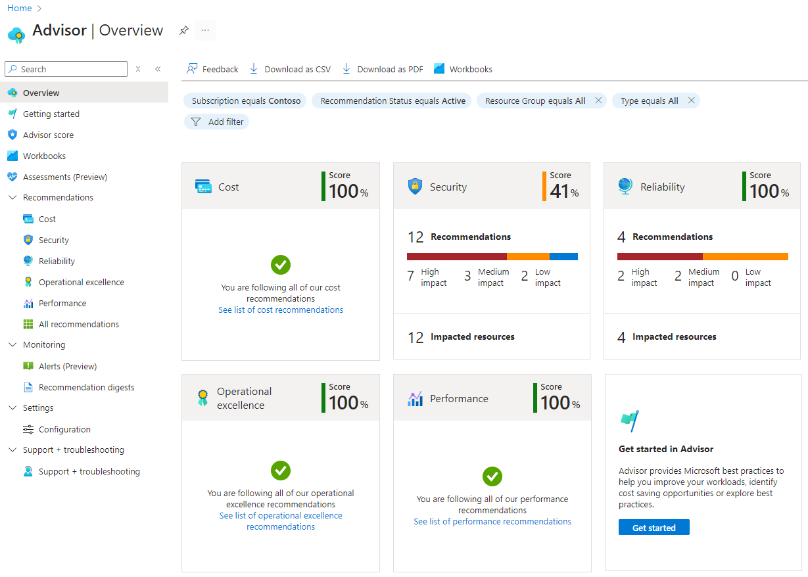

**Azure Cloud governance with Azure Policy and Azure Resource Manager**

1. Azure Policy

Azure's primary governance tool is Azure Policy. Azure Policy facilitates the governance of all resources, including current and forthcoming resources. It helps to enforce organizational standards and to assess compliance at scale by establishing `guardrails` across various resources

Some useful governance actions that you can enforce with Azure Policy include:
```
- Ensure that your team deploys Azure resources only to allowed regions.
- Enforce geo-replication rules to comply with your data residency requirements.
- Allow only certain virtual machine sizes for your cloud environment.
- Enforce the consistent application of taxonomic tags across resources.
- Recommend system updates on your servers.
- Allow multifactor authentication for all subscription accounts.
- Require resources to send diagnostic logs to an Azure Monitor Logs workspace.
```

2. Azure Resource Manager

Azure Policy is integrated with Azure Resource Manager.Azure Resource Manager is the deployment and management service for Azure. It provides a management layer that allows you to create, update, and delete resources in your Azure account. Azure Resource Manager manages essential functions, such as template-based deployments, role-based access control (RBAC), auditing, monitoring, and tagging, which provides a unified management experience for Azure resources after deployment. For example, consider a scenario where you have a storage account. With Azure Resource Manager, you can create the storage account and enforce a Azure policy that mandates encryption for all storage accounts

**Azure RBAC**

Azure RBAC is an authorization system built on Azure Resource Manager that provides fine-grained access management for resources in Azure. With Azure RBAC, you can grant the exact access that users need to do their jobs. For example, you can use Azure RBAC to let one employee manage virtual machines in a subscription, while another manages SQL databases within the same subscription.

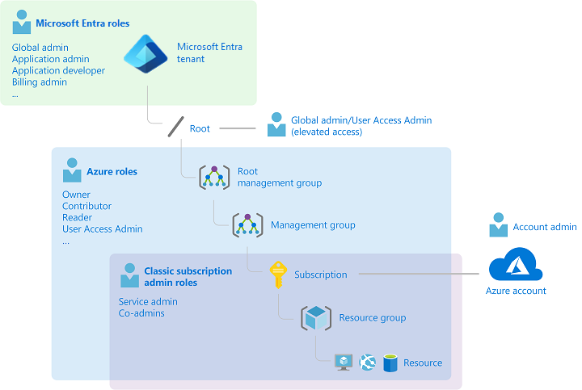


**(VNet) Azure Virtual Network**

An Azure virtual network is a logical isolation of the Azure cloud resources. Each virtual network has its own Classless Inter-Domain Routing (CIDR) block and can be linked to other virtual networks and on-premises networks.You control the DNS server settings for virtual networks, and segmentation of the virtual network into subnets.

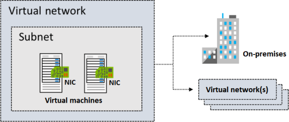
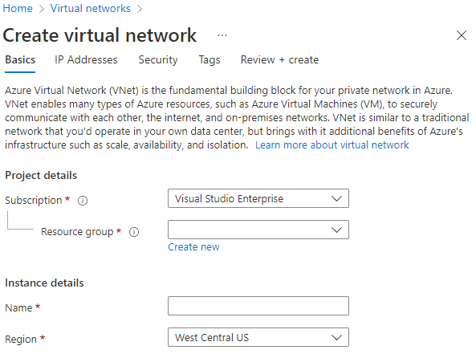

**Subnets**

Virtual network can be segmented into subnets to help improve security, increase performance, and make it easier to manage. Each subnet contains a range of IP addresses that fall within the virtual network address space. For each subnet, Azure reserves five IP addresses. The first four addresses and the last address are reserved.
```
192.168.1.0	This value identifies the virtual network address.
192.168.1.1	Azure configures this address as the default gateway.
192.168.1.2 and 192.168.1.3	Azure maps these Azure DNS IP addresses to the virtual network space.
192.168.1.255	This value supplies the virtual network broadcast address.
```
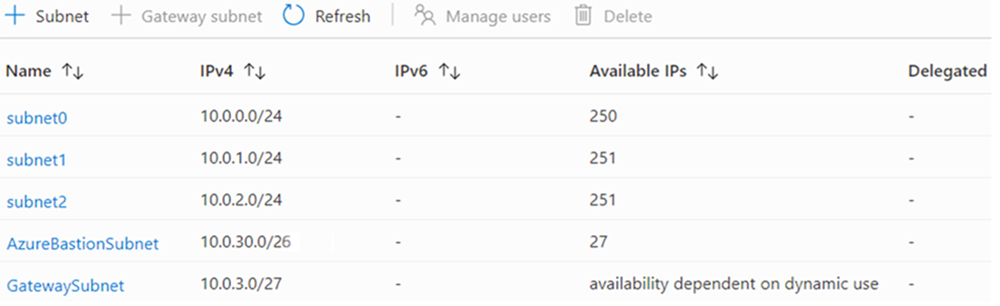

**Azure IP Addresses**

There are two types of Azure IP addresses: `private and public`.

Private IP addresses enable communication within an Azure virtual network and your on-premises network. You create a private IP address for your resource when you use a VPN gateway or Azure ExpressRoute circuit to extend your network to Azure. Public IP addresses allow your resource to communicate with the internet. You can create a public IP address to connect with Azure public-facing services.

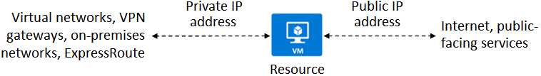

**NSG Network Security Groups**

A network security group contains a list of security rules that allow or deny inbound or outbound network traffic.
A network security group can be associated to a subnet or a network interface.
You can assign network security groups to a subnet and create a protected screened subnet (also referred to as a demilitarized zone or DMZ). A DMZ acts as a buffer between resources within your virtual network and the internet.
Use the network security group to restrict traffic flow to all machines that reside within the subnet.
Each subnet can have a maximum of one associated network security group.
Each network interface that exists in a subnet can have zero, or one, associated network security groups.

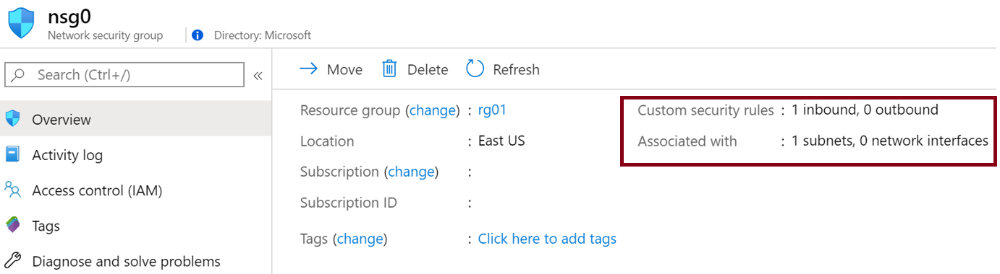
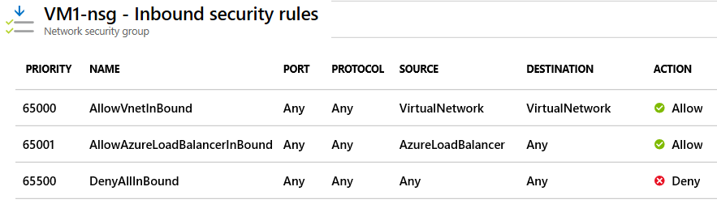
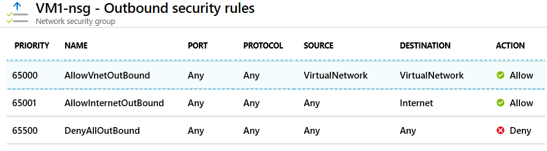

View effective security rules: If you have several network security groups and aren't sure which security rules are being applied, you can use the Effective security rules link in the Azure portal. You can use the link to verify which security rules are applied to your machines, subnets, and network interfaces.

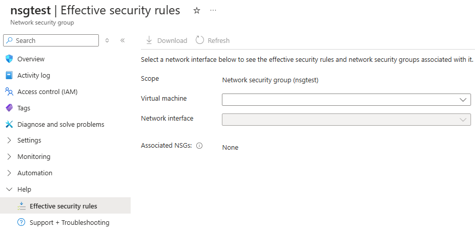

**ASG Application Security Group**

Application security groups work in the same way as network security groups, but they provide an application-centric way of looking at your infrastructure. You join your virtual machines to an application security group. Then you use the application security group as a source or destination in the network security group rules.

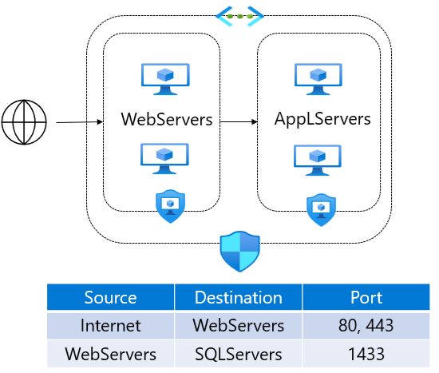

**Azure DNS**

Azure DNS is a hosting service for Domain Name System (DNS) domains that provides name resolution by using Microsoft Azure infrastructure. Whether a third-party host your DNS server or you manage it in-house, you need to configure it for each host type you're using. Host types include web, email, or other services you're using.

Configuration information for your DNS server is stored as a file within a zone on your DNS server. Each file is called a record. The following record types are the most commonly created and used:
```
A is the host record, and is the most common type of DNS record. It maps the domain or host name to the IP address.
CNAME is a Canonical Name record that's used to create an alias from one domain name to another domain name. If you had different domain names that all accessed the same website, you'd use CNAME.
MX is the mail exchange record. It maps mail requests to your mail server, whether hosted on-premises or in the cloud.
TXT is the text record. It's used to associate text strings with a domain name. Azure and Microsoft 365 use TXT records to verify domain ownership.

Additionally, there are the following record types:

Wildcards
CAA (certificate authority)
NS (name server)
SOA (start of authority)
SPF (sender policy framework)
SRV (server locations)

The SOA and NS records are created automatically when you create a DNS zone by using Azure DNS.
```

**Vnet Peering**

Virtual Network peering enables you to seamlessly connect two Azure virtual networks. After the networks are peered, the two virtual networks operate as a single network, for connectivity purposes.

There are two types of Azure Virtual Network peering: regional and global.

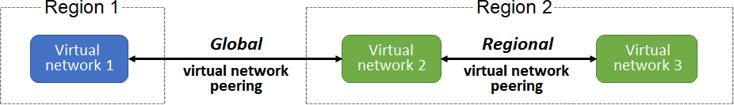

**Azure VPN Gateway**

Azure VPN Gateway is a service that can be used to send encrypted traffic between an Azure virtual network and on-premises locations over the public Internet. You can also use VPN Gateway to send encrypted traffic between Azure virtual networks over the Microsoft network. 

Because you can create multiple connection configurations using VPN Gateway, you need to determine which configuration best fits your needs. Point-to-site, site-to-site, and coexisting ExpressRoute/site-to-site connections all have different instructions and resource configuration requirements.

Every Azure VPN gateway consists of two instances in an active-standby configuration by default. For any planned maintenance or unplanned disruption that happens to the active instance, the standby instance takes over automatically (failover), and resumes the S2S VPN or VNet-to-VNet connections.

1. Site-to-site VPN

A site-to-site connection requires a VPN device located on-premises that has a public IP address assigned to it.

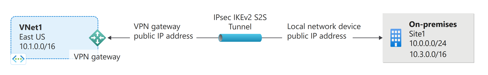   
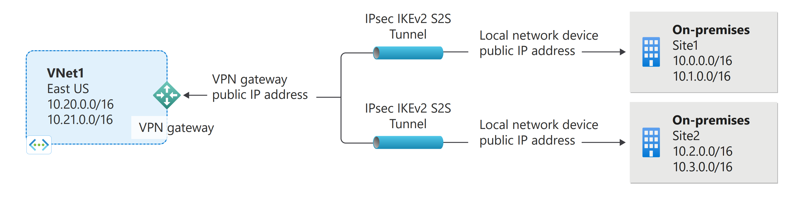

2. Point-to-site VPN

This solution is useful for telecommuters who want to connect to Azure virtual networks from a remote location, such as from home or a conference. Point-to-site VPN is also a useful solution to use instead of site-to-site VPN when you have only a few clients that need to connect to a virtual network.

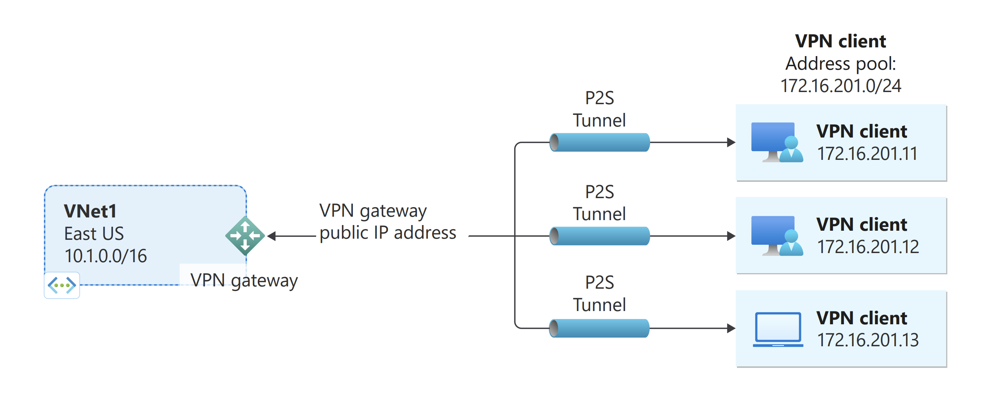

**Local Network Gateway**

The local network gateway is a specific object that represents your on-premises location (the site) for routing purposes. The local network gateway object is deployed in Azure, not to your on-premises location. You give the site a name by which Azure can refer to it, and then specify the IP address of the on-premises VPN device to which you create a connection.

**Service Chaining**

Service chaining enables you to direct traffic from one virtual network to a virtual appliance or gateway in a peered network through user-defined routes (UDRs).  To enable service chaining, configure UDRs that point to virtual machines in peered virtual networks as the next hop IP address. UDRs could also point to virtual network gateways to enable service chaining.


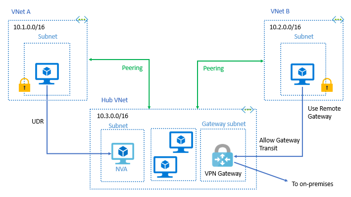


**Example Architecture diagrams**

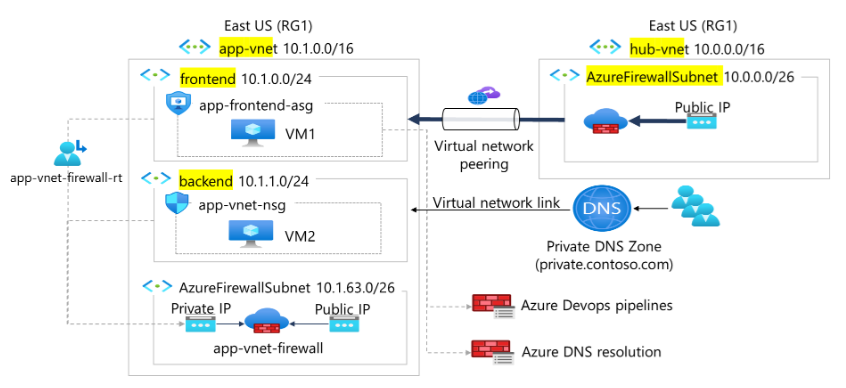


**Virtual network service endpoint**

Virtual network endpoints extend your private address space in Azure by providing a direct connection to your Azure resources. This connection restricts the flow of traffic: your Azure virtual machines can access your storage account directly from the private address space and deny access from a public virtual machine. As you enable service endpoints, Azure creates routes in the route table to direct this traffic.

**What is NVA**

A network virtual appliance (NVA) is a virtual appliance that consists of various layers like:

- A firewall
- A WAN optimizer
- Application-delivery controllers
- Routers
- Load balancers
- IDS/IPS
- Proxies

Network virtual appliances (NVAs) are virtual machines that control the flow of network traffic by controlling routing. You'll typically use them to manage traffic flowing from a perimeter-network environment to other networks or subnets.You can deploy NVAs that you choose from providers in Azure Marketplace. Such providers include Cisco, Check Point, Barracuda, Sophos, WatchGuard, and SonicWall. You can use an NVA to filter traffic inbound to a virtual network, to block malicious requests, and to block requests made from unexpected resources.Your goal is to prevent unwanted or unsecured network traffic from reaching key systems.


**Azure Load Balacing Solutions**

Azure provides other load-balancing solutions as alternatives to Azure Load Balancer including: 

- Azure Load Balancer
- Azure Front Door
- Azure Traffic Manager
- Azure Application Gateway

**Azure Load Balancer**

Azure Load Balancer is a high-performance, ultra-low-latency Layer 4 load-balancing service (inbound and outbound) for all UDP and TCP protocols. Its built to handle millions of requests per second while ensuring your solution is highly available. Azure Load Balancer is zone-redundant, ensuring high availability across availability zones.  Load Balancer delivers high availability and network performance in the following ways:
- Load-balancing rules determine how traffic is distributed to instances that comprise the back end.
- Health probes ensure the resources in the back end are healthy and that traffic isn't directed to unhealthy back-end instances.

Load Balancer has several elements that work together to ensure an application's high availability and performance:
- Front-end IP
- Load balancer rules
- Back-end pool
- Health probes
- Inbound NAT rules
- High availability ports
- Outbound rules

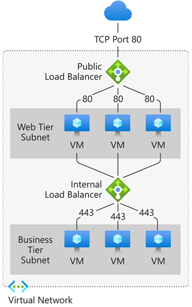
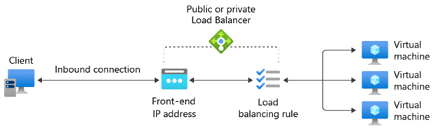


**Azure Front Door**

Azure Front Door is an application-delivery network that provides a global load balancing and site acceleration service for web applications. It offers Layer 7 capabilities for your application like TLS/SSL offload, path-based routing, fast failover, a web application firewall, and caching to improve performance and high availability of your applications. Choose this option in scenarios such as load balancing a web app deployed across multiple Azure regions.

**Azure Traffic Manager**

Azure Traffic Manager is a DNS-based traffic load balancer that allows you to distribute traffic optimally to services across global Azure regions while providing high availability and responsiveness. Because Traffic Manager is a DNS-based load-balancing service, it load balances only at the domain level. For that reason, it can't fail over as quickly as Front Door, because of common challenges around DNS caching and systems not honoring DNS TTLs.

**Azure Application Gateway**

Azure Application Gateway offering various Layer 7 load-balancing capabilities. Application Gateway provides features such as load balancing HTTP traffic and web application firewall. It provides support for TLS/SSL encryption of traffic between users and an application gateway and between application servers and an application gateway.

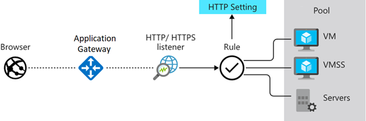

Azure Application Gateway includes the following features:

- Support for the HTTP, HTTPS, HTTP/2, and WebSocket protocols.
- A web application firewall to protect against web application vulnerabilities.
- End-to-end request encryption.
- Autoscaling to dynamically adjust capacity as your web traffic load change.
- Connection draining allowing graceful removal of back-end pool members during planned service updates.

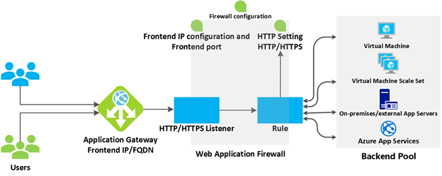

- Path Based Routing & Multiple Site Routing

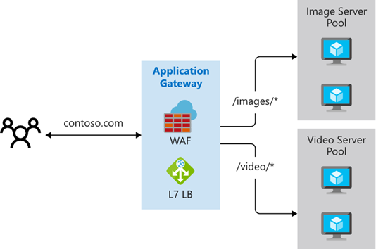
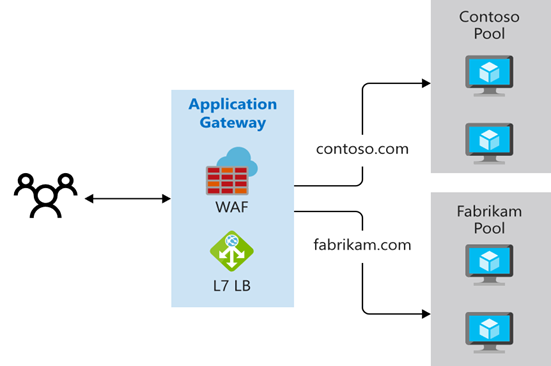

- AutoScaling

Application Gateway supports autoscaling, and can scale up or down based on changing traffic load patterns. Autoscaling also removes the requirement to choose a deployment size or instance count during provisioning.

**Azure Network Watcher**

Azure Network Watcher provides a suite of tools to monitor, diagnose, view metrics, and enable or disable logs for Azure IaaS (Infrastructure-as-a-Service) resources. Network Watcher enables you to monitor and repair the network health of IaaS products like virtual machines (VMs), virtual networks (VNets), application gateways, load balancers, etc. Network Watcher isn't designed or intended for PaaS monitoring or Web analytics.